# Documentacion completa de pap_air

## 0. Proposito de este manual

Este documento explica el proyecto `pap_air` de arriba a abajo, como si fuera
la parte teorica de una practica. La idea no es solo decir "que hace" el
programa, sino explicar:

- como esta organizado;
- que datos maneja;
- como circula la informacion entre CPU y GPU;
- que hace cada funcion importante;
- como funcionan los kernels;
- que decisiones de implementacion se han tomado y por que;
- como se resuelven matematicamente las fases 01, 02, 03 y 04.

El estado que se documenta aqui es el **codigo actual real** de:

- `PL1_CUDA/src/main.cu`
- `PL1_CUDA/src/kernels.cuh`
- `PL1_CUDA/src/kernels.cu`
- `PL1_CUDA/src/csv_reader.h`
- `PL1_CUDA/src/csv_reader.cpp`

No se documenta una arquitectura ideal ni una version antigua. Todo lo que
aparece aqui intenta corresponder con el codigo que esta en el repositorio.

---

## 1. Vista general del proyecto

### 1.1. Idea global

`pap_air` es una aplicacion de consola en C++/CUDA que trabaja sobre un CSV del
dataset de vuelos de aerolineas de Estados Unidos. El programa hace cuatro
cosas principales:

1. Carga y limpia el CSV.
2. Sube a GPU las columnas que va a reutilizar varias veces.
3. Ejecuta distintas fases CUDA sobre retrasos y aeropuertos.
4. Devuelve a consola resultados legibles para la practica.

### 1.2. Archivos principales

| Archivo | Lineas aprox. | Papel |
|---|---:|---|
| `PL1_CUDA/src/main.cu` | 1269 | Flujo host, CLI, estado global, subida a GPU y orquestacion |
| `PL1_CUDA/src/kernels.cuh` | 87 | Declaraciones CUDA publicas |
| `PL1_CUDA/src/kernels.cu` | 368 | Implementacion de kernels y helpers device |
| `PL1_CUDA/src/csv_reader.h` | 86 | Tipos del dataset y API del lector |
| `PL1_CUDA/src/csv_reader.cpp` | 275 | Carga y limpieza del CSV |

### 1.3. Arquitectura por modulos

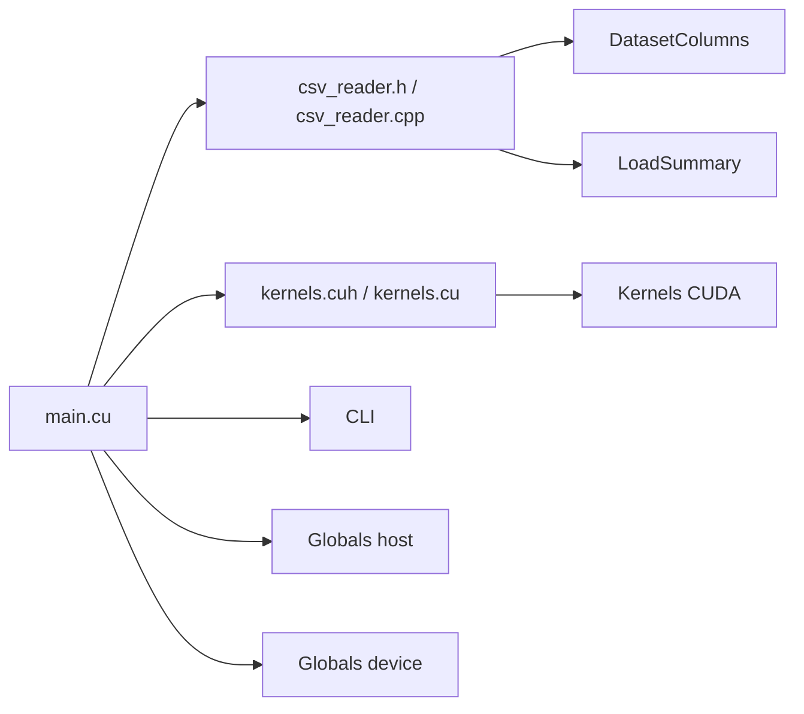

### 1.4. Filosofia de implementacion

La version actual intenta ser mas simple que una arquitectura muy encapsulada.
Por eso:

- `main.cu` usa **globals host/device**;
- el dataset que hace falta para varias fases se sube una sola vez a GPU;
- `csv_reader` se dedica solo a leer el CSV;
- `kernels.cu` concentra la logica device;
- se evita pasar structs grandes de una funcion a otra.

La consecuencia de esta decision es importante:

- se pierde algo de encapsulacion "profesional";
- se gana legibilidad directa del flujo global;
- el codigo se parece mas a una implementacion academica de practica.

---

## 2. Flujo global del programa

### 2.1. Arranque

El ciclo completo del programa es este:

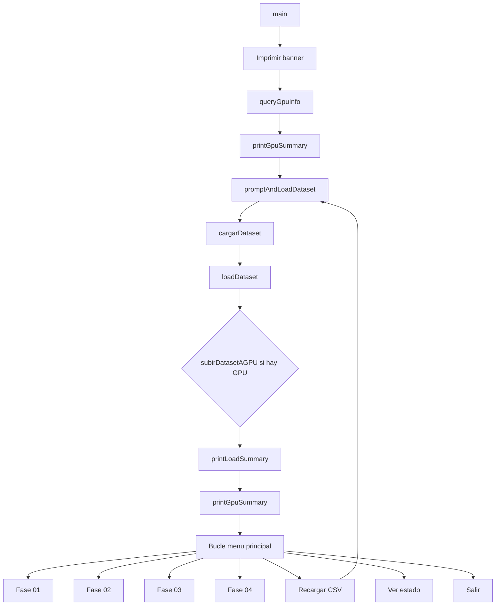

### 2.2. Ciclo de estados

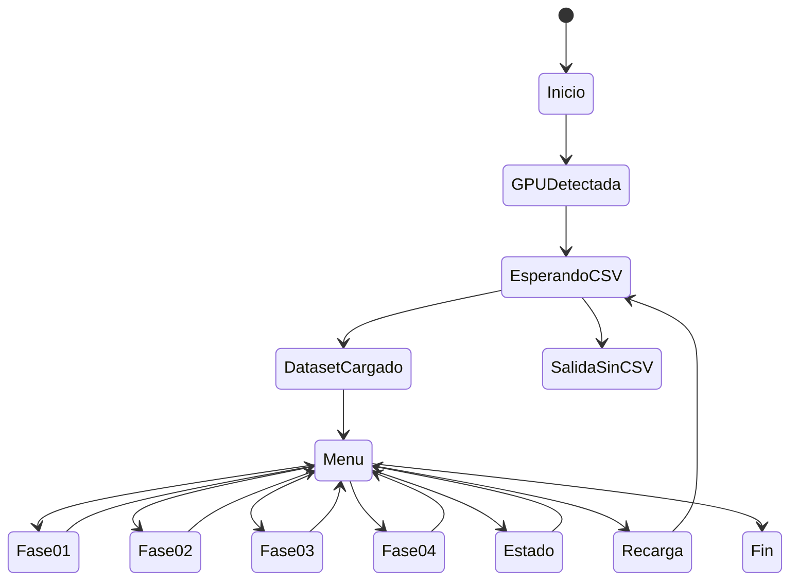

### 2.3. Flujo de datos

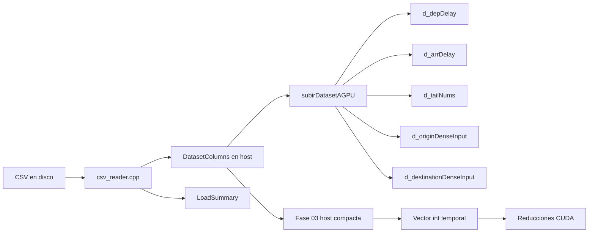

---

## 3. Estructuras y estado global

## 3.1. `DatasetColumns`

`DatasetColumns` vive en `csv_reader.h`. Es la representacion del CSV en
memoria host.

```cpp
struct DatasetColumns {
    std::vector<float> depDelay;
    std::vector<float> arrDelay;
    std::vector<float> weatherDelay;
    std::vector<std::string> tailNum;
    std::vector<int> originSeqId;
    std::vector<int> destSeqId;
    std::unordered_map<int, std::string> originIdToCode;
    std::unordered_map<int, std::string> destIdToCode;
};
```

### Que significa cada campo

- `depDelay`: retraso de salida, usado en Fases 01 y 03.
- `arrDelay`: retraso de llegada, usado en Fases 02 y 03.
- `weatherDelay`: retraso meteorologico, usado en Fase 03.
- `tailNum`: matricula del avion, usada en Fase 02.
- `originSeqId`: identificador de aeropuerto origen, usado en Fase 04.
- `destSeqId`: identificador de aeropuerto destino, usado en Fase 04.
- `originIdToCode`: mapa `SEQ_ID -> codigo` para imprimir origen en CPU.
- `destIdToCode`: mapa `SEQ_ID -> codigo` para imprimir destino en CPU.

### Idea importante

Los seis vectores por fila mantienen **alineacion posicional**. La fila logica
`i` del CSV se representa con:

- `depDelay[i]`
- `arrDelay[i]`
- `weatherDelay[i]`
- `tailNum[i]`
- `originSeqId[i]`
- `destSeqId[i]`

Esto es importante porque las fases 01 y 02 trabajan por indice de fila y la
Fase 04 densifica a partir de esos IDs.

## 3.2. `LoadSummary`

`LoadSummary` resume la Fase 0:

```cpp
struct LoadSummary {
    std::size_t rowsRead = 0;
    std::size_t storedRows = 0;
    std::size_t discardedRows = 0;
    std::size_t missingTailNum = 0;
    std::size_t missingOriginSeqId = 0;
    std::size_t missingOriginAirportCode = 0;
    std::size_t missingDestSeqId = 0;
    std::size_t missingDestAirportCode = 0;
    std::size_t missingDepDelay = 0;
    std::size_t missingArrDelay = 0;
    std::size_t missingWeatherDelay = 0;
    std::size_t uniqueOriginSeqIds = 0;
    std::size_t uniqueDestinationSeqIds = 0;
};
```

No guarda datos de computo, solo trazabilidad de la carga.

## 3.3. Globals host y device de `main.cu`

`main.cu` tiene un bloque de globals simples. Son la base de toda la
arquitectura actual.

### Host

| Global | Tipo | Papel |
|---|---|---|
| `g_dataset` | `DatasetColumns` | Dataset completo en host |
| `g_summary` | `LoadSummary` | Resumen de la carga |
| `g_datasetPath` | `std::string` | Ruta del CSV actual |
| `g_datasetLoaded` | `bool` | Si hay dataset valido en memoria |
| `g_deviceReady` | `bool` | Si la GPU CUDA esta disponible |
| `g_deviceProp` | `cudaDeviceProp` | Propiedades del dispositivo |
| `g_deviceErrorMessage` | `std::string` | Motivo si CUDA no esta lista |
| `g_rowCount` | `int` | Numero de filas utiles del dataset |
| `g_originDenseToSeqId` | `std::vector<int>` | Mapa inverso denso -> `SEQ_ID` origen |
| `g_destinationDenseToSeqId` | `std::vector<int>` | Mapa inverso denso -> `SEQ_ID` destino |

### Device

| Global | Tipo | Papel |
|---|---|---|
| `d_depDelay` | `float*` | Columna `DEP_DELAY` en GPU |
| `d_arrDelay` | `float*` | Columna `ARR_DELAY` en GPU |
| `d_tailNums` | `char*` | Matriculas linealizadas |
| `d_phase2Count` | `int*` | Contador global de Fase 02 |
| `d_phase2OutDelayValues` | `int*` | Retrasos detectados en Fase 02 |
| `d_phase2OutTailNums` | `char*` | Matriculas detectadas en Fase 02 |
| `d_originDenseInput` | `int*` | Entrada densa origen para histograma |
| `d_destinationDenseInput` | `int*` | Entrada densa destino para histograma |

### Metadatos de Fase 04

| Global | Papel |
|---|---|
| `g_originTotalElements` | Numero de filas validas de origen densificadas |
| `g_originTotalBins` | Numero de bins unicos de origen |
| `g_destinationTotalElements` | Numero de filas validas de destino densificadas |
| `g_destinationTotalBins` | Numero de bins unicos de destino |

### Diagrama de estado global

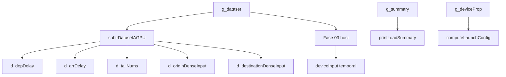

---

## 4. `csv_reader`: lectura y limpieza del CSV

## 4.1. Columnas del CSV que se usan

`csv_reader.cpp` fija indices constantes:

| Indice | Columna | Uso |
|---:|---|---|
| 3 | `TAIL_NUM` | Fase 02 |
| 5 | `ORIGIN_SEQ_ID` | Fase 04 |
| 6 | `ORIGIN_AIRPORT` | Fase 04, impresion |
| 7 | `DEST_SEQ_ID` | Fase 04 |
| 8 | `DEST_AIRPORT` | Fase 04, impresion |
| 10 | `DEP_DELAY` | Fases 01 y 03 |
| 12 | `ARR_DELAY` | Fases 02 y 03 |
| 13 | `WEATHER_DELAY` | Fase 03 |

La carga es **selectiva**: no se guardan columnas que hoy no usa el programa.

## 4.2. `trimWhitespace`

Funcion:

- recorre desde el principio hasta encontrar un caracter no blanco;
- recorre desde el final hacia atras;
- devuelve el substring limpio.

Matematicamente:

- si `text = "   A  "`, busca `start = 3`, `end = 4`, y devuelve `text[3:4]`.

## 4.3. `clearDataset`

Resetea todos los contenedores de `DatasetColumns`. Es importante porque
`loadDataset()` puede reutilizar un objeto ya existente.

## 4.4. `countMissingFloat`

Incrementa un contador si `value` es `NAN`. No transforma nada; solo anota
estadistica.

## 4.5. `rememberAirportCode`

Guarda una pareja `SEQ_ID -> codigo` solo si:

- `seqId >= 0`
- `code` no es vacio
- ese `seqId` aun no existe en el mapa

Esto evita sobrescribir la primera aparicion valida de un aeropuerto.

## 4.6. `splitCsvLineSimple`

Esta funcion implementa un parser CSV sencillo:

```cpp
std::vector<std::string> splitCsvLineSimple(const std::string& line)
{
    std::vector<std::string> tokens;
    std::string currentToken;
    bool insideQuotes = false;

    for (std::size_t i = 0; i < line.size(); ++i) {
        const char currentChar = line[i];

        if (currentChar == '"') {
            if (insideQuotes && i + 1 < line.size() && line[i + 1] == '"') {
                currentToken.push_back('"');
                ++i;
            } else {
                insideQuotes = !insideQuotes;
            }
            continue;
        }

        if (currentChar == ',' && !insideQuotes) {
            tokens.push_back(currentToken);
            currentToken.clear();
            continue;
        }

        if (currentChar != '\r') {
            currentToken.push_back(currentChar);
        }
    }

    tokens.push_back(currentToken);
    return tokens;
}
```

### Como funciona

- `insideQuotes = false`: una coma corta token.
- `insideQuotes = true`: una coma se interpreta como parte del campo.
- `""` dentro de comillas se interpreta como una comilla literal.
- `\r` se ignora.

### Ejemplo

Entrada:

```text
1,"AA,TEST",3
```

Salida:

- token 0: `1`
- token 1: `AA,TEST`
- token 2: `3`

## 4.7. `cleanQuotedToken`

Hace dos limpiezas:

1. elimina espacios exteriores;
2. si el token empieza y termina con `"` quita esas comillas.

## 4.8. `parseFloatOrNan`

Convierte texto en `float` con una politica deliberada:

- si el token esta vacio -> devuelve `NAN`
- si `std::stof` falla -> devuelve `NAN`
- si no consume todo el token -> devuelve `NAN`

### Interpretacion matematica

El programa usa `NAN` como marca de "dato ausente o invalido". Eso permite:

- mantener la fila en el dataset;
- decidir mas tarde si se ignora en una fase concreta;
- no inventar un numero centinela que pudiera confundirse con un dato real.

## 4.9. `parseIntFromFloatToken`

Lee un campo numerico del CSV como `float` y luego lo trunca a `int`.

Regla:

- si el valor es `NAN` -> devuelve `false` y deja `parsedValue = -1`
- si el valor es valido -> `parsedValue = static_cast<int>(parsedFloat)`

Ejemplos:

- `123.0` -> `123`
- `123.9` -> `123`
- vacio -> `-1`

## 4.10. `loadDataset`

`loadDataset()` es la funcion central del lector.

### Flujo de la funcion

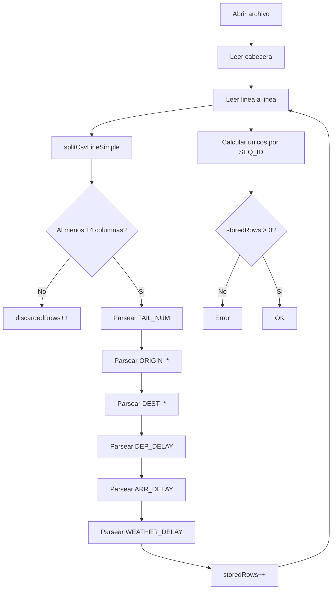

### Politica de limpieza

- la cabecera se lee y se descarta;
- una fila con menos de 14 columnas se descarta;
- una fila con campos vacios se conserva;
- los faltantes numericos se guardan como `NAN`;
- los IDs ausentes se guardan como `-1`;
- los codigos vacios se guardan como cadena vacia;
- se cuentan faltantes y categorias unicas.

### Ejemplo de una fila

Supongamos:

```text
...,N12345,...,12001,JFK,12478,LAX,...,15.7,...,-3.2,0.0
```

La fila se transforma en:

- `tailNum.push_back("N12345")`
- `originSeqId.push_back(12001)`
- `destSeqId.push_back(12478)`
- `depDelay.push_back(15.7f)`
- `arrDelay.push_back(-3.2f)`
- `weatherDelay.push_back(0.0f)`

Y ademas:

- `originIdToCode[12001] = "JFK"`
- `destIdToCode[12478] = "LAX"`

### Diagrama del pipeline de una fila

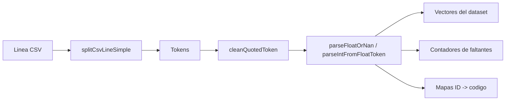

---

## 5. `main.cu`: host, globals y orquestacion

## 5.1. `LaunchConfig`

```cpp
struct LaunchConfig {
    int blocks = 0;
    int threadsPerBlock = 1;
};
```

Solo guarda la configuracion minima de un lanzamiento 1D.

## 5.2. `Phase3AtomicVariant`

Este `enum class` no representa fases del menu, sino solo las tres variantes
atomicas de la Fase 03:

- `Simple`
- `Basic`
- `Intermediate`

La cuarta, `Reduccion`, se ejecuta por otra ruta (`phase03ReductionVariant`).

## 5.3. Helpers de entrada

### `fileExists`

Comprueba si una ruta de CSV existe y se puede abrir.

### `isCancelToken`

Centraliza la politica de cancelacion:

- `x`
- `X`

### `pauseForEnter`

Introduce una pausa explicita de consola. No cambia estado de programa; solo
hace mas usable la ejecucion interactiva.

### `readIntegerInRange`

Lee un entero con estas reglas:

- usa `std::getline`;
- limpia con `trimWhitespace`;
- permite cancelar con `X`;
- rechaza basura textual;
- verifica rango `[minValue, maxValue]`.

### `readSignedThreshold`

Lee un entero firmado para Fases 01 y 02. La semantica es:

- positivo o cero -> retrasos
- negativo -> adelantos

No existe ya un modo separado "retraso/adelanto/ambos". La decision se toma
solo con el signo del umbral.

## 5.4. `cudaOk` y `ejecutarKernelYEsperar`

Estas dos funciones concentran la gestion de error CUDA del host.

### `cudaOk`

- recibe un `cudaError_t`
- si es `cudaSuccess`, devuelve `true`
- si no, imprime el contexto y devuelve `false`

### `ejecutarKernelYEsperar`

Hace el patron tipico despues de un kernel:

1. `cudaGetLastError()`
2. `cudaDeviceSynchronize()`

Es decir, detecta:

- errores de lanzamiento;
- errores ocurridos durante la ejecucion.

---

## 6. Deteccion de GPU y configuracion de lanzamiento

## 6.1. `queryGpuInfo`

Flujo:

1. llama a `cudaGetDeviceCount`
2. si falla, guarda el error
3. si no hay dispositivos, guarda un mensaje propio
4. llama a `cudaGetDeviceProperties`
5. rellena:
   - `g_deviceReady`
   - `g_deviceProp`
   - `g_deviceErrorMessage`

### Diagrama

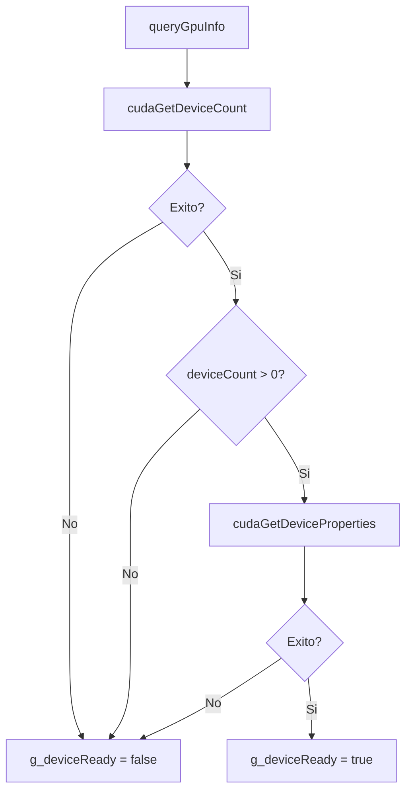

## 6.2. `computeLaunchConfig`

Esta funcion calcula:

- `threadsPerBlock = min(256, maxThreadsPerBlock)`
- `blocks = ceil(totalElements / threadsPerBlock)`

Matematicamente:

```text
blocks = (totalElements + threadsPerBlock - 1) / threadsPerBlock
```

Esto es una division entera redondeada hacia arriba.

Ejemplo:

- `totalElements = 1000`
- `threadsPerBlock = 256`

Entonces:

```text
blocks = (1000 + 255) / 256 = 1255 / 256 = 4
```

---

## 7. Construccion del dataset en GPU

## 7.1. Idea general

El programa no sube todo el dataset host a GPU. Solo sube lo que reutiliza:

- `DEP_DELAY`
- `ARR_DELAY`
- `TAIL_NUM`
- entradas densas de origen/destino para Fase 04
- buffers de salida de Fase 02

`WEATHER_DELAY` se queda en host porque solo se usa en Fase 03 y esa fase ya
compacta su entrada en cada ejecucion.

## 7.2. `buildTailBuffer`

Convierte `std::vector<std::string>` en un buffer plano de `char`.

### Regla

Cada matricula ocupa exactamente `kPhase2TailNumStride = 16` bytes.

Estructura:

```text
[fila0................][fila1................][fila2................]
```

Cada bloque de 16 bytes:

- contiene como mucho 15 caracteres utiles;
- se termina en `'\0'`.

### Ejemplo

Si:

- `tailNum[0] = "N123AA"`
- `tailNum[1] = "ECXYZ"`

El buffer queda conceptualmente:

```text
N123AA\0.........ECXYZ\0..........
```

### Por que se hace asi

Porque la GPU trabaja mejor con arrays lineales simples que con vectores de
`std::string`.

## 7.3. `buildDenseInput`

Esta funcion es clave para la Fase 04. Convierte una columna de `SEQ_ID` en una
columna densa de indices `[0, totalBins)`.

### Problema original

Los `SEQ_ID` reales no suelen ser consecutivos. Si se usaran como indice
directo, el histograma podria ser muy grande y con muchisimos huecos.

### Solucion

Se crea una correspondencia:

```text
SEQ_ID real -> denseIndex
```

Y se guarda tambien la inversa:

```text
denseToSeqId[denseIndex] = SEQ_ID real
```

### Ejemplo

Entrada:

```text
seqIds = [12001, 12478, 12001, 13055]
```

Resultado:

```text
denseToSeqId = [12001, 12478, 13055]
denseInput   = [0, 1, 0, 2]
```

### Diagrama

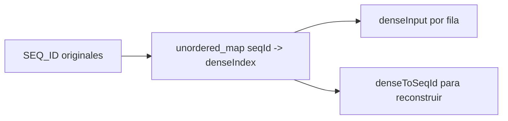

## 7.4. `liberarGPU`

Centraliza toda la liberacion de memoria device:

- columnas base;
- buffers de Fase 02;
- entradas densas de Fase 04;
- metadatos asociados.

Es importante porque la recarga del CSV no hace "parches" sobre memoria vieja;
libera y vuelve a construir.

## 7.5. `subirDatasetAGPU`

Esta es la funcion principal del ciclo de vida GPU.

### Flujo

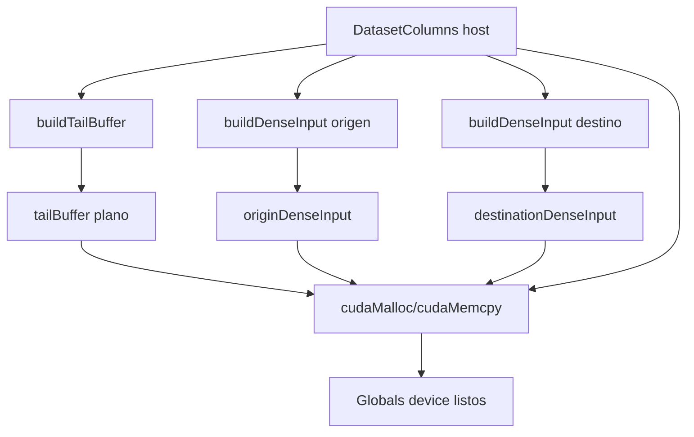

### Reservas que hace

- `d_depDelay`
- `d_arrDelay`
- `d_tailNums`
- `d_phase2Count`
- `d_phase2OutDelayValues`
- `d_phase2OutTailNums`
- `d_originDenseInput` si hay origenes validos
- `d_destinationDenseInput` si hay destinos validos

### Copias que hace

- `depDelay -> d_depDelay`
- `arrDelay -> d_arrDelay`
- `tailBuffer -> d_tailNums`
- `originDenseInput -> d_originDenseInput`
- `destinationDenseInput -> d_destinationDenseInput`

### Que no hace

- no sube `weatherDelay`
- no sube mapas `ID -> codigo`
- no sube `LoadSummary`

---

## 8. Resumenes y gestion de estado

## 8.1. `printLoadSummary`

Imprime:

- ruta del CSV;
- filas leidas;
- filas almacenadas;
- filas descartadas;
- faltantes de todas las columnas usadas;
- categorias unicas por `SEQ_ID`.

Es la salida principal de la Fase 0.

## 8.2. `printGpuSummary`

Imprime:

- nombre de la GPU;
- compute capability;
- memoria global;
- memoria compartida por bloque;
- maximo de hilos por bloque;
- sugerencia base de lanzamiento;
- si el dataset ya esta subido para Fases 01, 02 y 04.

## 8.3. `cargarDataset`

Esta funcion une dos mundos:

1. carga el CSV en host con `loadDataset(...)`
2. si hay GPU, llama a `subirDatasetAGPU(...)`

Si ambas cosas van bien, actualiza:

- `g_datasetPath`
- `g_dataset`
- `g_summary`
- `g_datasetLoaded`

### Llamadas

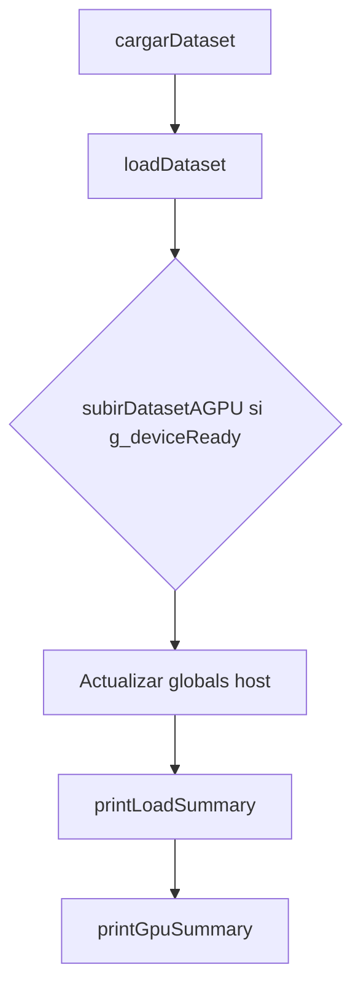

## 8.4. `promptAndLoadDataset`

Es la capa interactiva de la carga:

- propone ruta por defecto;
- acepta `Intro` para usarla;
- acepta `X` para cancelar;
- insiste hasta que se cargue bien o se cancele.

## 8.5. `datasetListoParaGPU`

Comprueba tres condiciones:

- dataset cargado en host;
- GPU disponible;
- dataset subido a GPU.

Es la precondicion comun a todas las fases CUDA.

---

## 9. Fase 01: retraso en salida

## 9.1. Objetivo

Procesar `DEP_DELAY` en GPU y mostrar por consola los vuelos cuyo retraso o
adelanto supera un umbral firmado.

## 9.2. Funcion host: `phase01`

Flujo:

1. calcula `LaunchConfig`
2. imprime la configuracion visible
3. lanza `phase1DepartureDelayKernel`
4. llama a `ejecutarKernelYEsperar`

### Diagrama

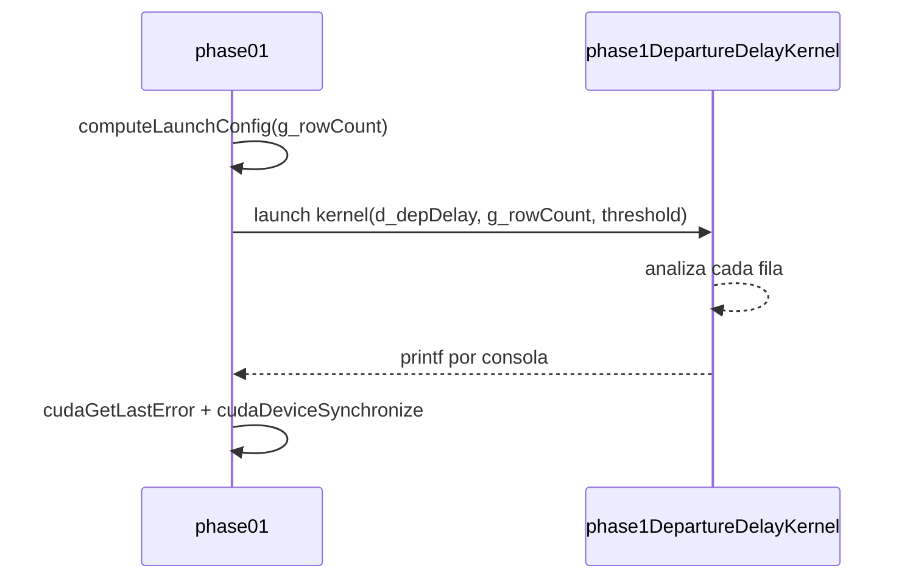

## 9.3. Kernel: `phase1DepartureDelayKernel`

Codigo esencial:

```cpp
const int idx = blockIdx.x * blockDim.x + threadIdx.x;
if (idx >= totalElements) return;

const float rawValue = delayValues[idx];
if (rawValue != rawValue) return;

const int delayValue = static_cast<int>(rawValue);
if (matchesSignedThreshold(delayValue, threshold)) {
    printf(...);
}
```

### Explicacion matematica

#### 1. Indexacion 1D

Cada hilo procesa una fila:

```text
idx = blockIdx.x * blockDim.x + threadIdx.x
```

#### 2. Ignorar `NAN`

En IEEE 754, `NAN != NAN`. Por eso:

```text
rawValue != rawValue  <=>  rawValue es NAN
```

#### 3. Truncado a entero

```text
delayValue = trunc(rawValue)
```

Ejemplos:

- `10.9 -> 10`
- `-3.7 -> -3`

#### 4. Regla del umbral firmado

Si `threshold >= 0`:

```text
aceptar si delayValue >= threshold
```

Si `threshold < 0`:

```text
aceptar si delayValue <= threshold
```

### Ejemplo

Supongamos:

- `DEP_DELAY = [12.7, -8.3, NAN, 65.1]`
- `threshold = 20`

Tras truncar:

- `[12, -8, -, 65]`

Coincide solo `65`.

Si `threshold = -5`, coincide `-8`.

---

## 10. Fase 02: retraso en llegada y matriculas

## 10.1. Objetivo

Filtrar `ARR_DELAY` en GPU, devolver el subconjunto detectado y asociarle la
matricula `TAIL_NUM`.

## 10.2. Funcion host: `phase02`

Pasos:

1. calcula `LaunchConfig`
2. resetea `d_phase2Count` con `cudaMemset`
3. copia el umbral a memoria constante
4. lanza el kernel
5. sincroniza
6. copia el contador al host
7. copia retrasos y matriculas al host
8. imprime resumen CPU

### Diagrama

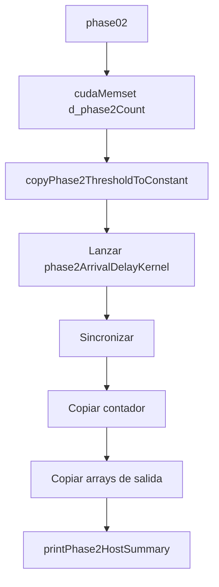

## 10.3. Memoria constante

`kernels.cu` declara:

```cpp
__constant__ int d_phase2Threshold;
```

La CPU lo rellena con:

```cpp
cudaMemcpyToSymbol(d_phase2Threshold, &threshold, sizeof(int));
```

Esto significa:

- todos los hilos leen el mismo umbral;
- el parametro no viaja en cada acceso a memoria global;
- conceptualmente es una configuracion global del kernel.

## 10.4. Kernel: `phase2ArrivalDelayKernel`

Flujo interno:

1. calcula `idx`
2. descarta fuera de rango
3. lee `ARR_DELAY[idx]`
4. descarta `NAN`
5. trunca a `int`
6. compara con `d_phase2Threshold`
7. si cumple:
   - reserva `outputIndex = atomicAdd(outCount, 1)`
   - escribe el retraso en `outDelayValues[outputIndex]`
   - copia la matricula a `outTailNumBuffer`
   - hace `printf`

### Por que hace falta `atomicAdd`

Muchos hilos pueden cumplir la condicion a la vez. Todos necesitan una
posicion distinta en la salida.

Si `outCount` valiera 7, varios hilos podrian competir por escribir en:

- posicion 7
- posicion 8
- posicion 9

`atomicAdd(outCount, 1)` garantiza que cada hilo obtiene un indice unico.

### Diagrama de la compaccion

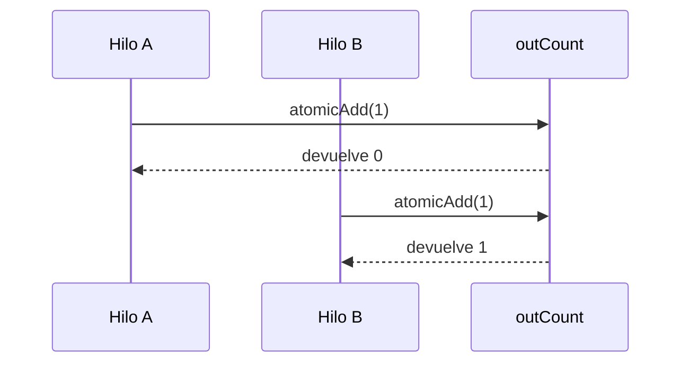

### Layout de matriculas

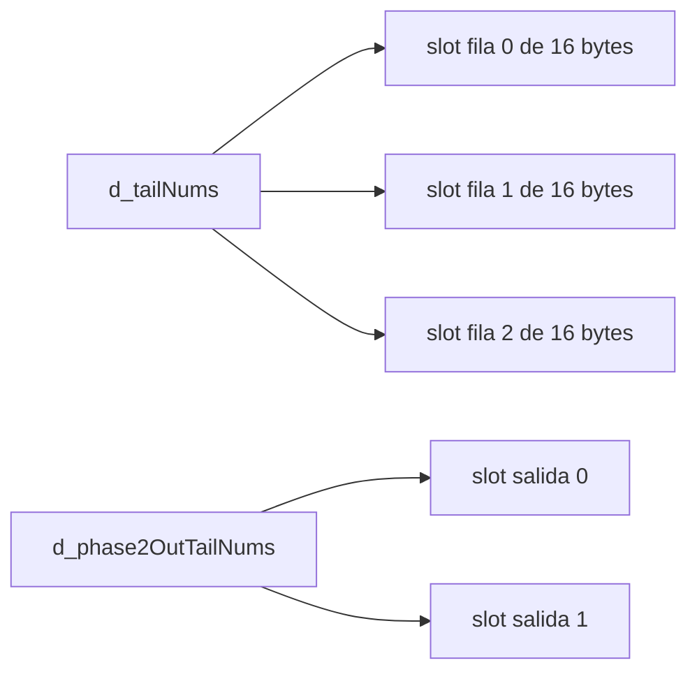

### Detalle de copia

El kernel copia exactamente `kPhase2TailNumStride` caracteres:

```cpp
for (int i = 0; i < kPhase2TailNumStride; ++i) {
    outputTailNum[i] = inputTailNum[i];
}
```

No usa strings dinamicos ni memoria compleja. Solo un bloque fijo de 16 bytes.

## 10.5. Resumen CPU final

`printPhase2HostSummary()` no vuelve a calcular nada. Solo interpreta los
buffers que la GPU ya ha producido y los muestra como:

- matricula
- etiqueta `Retraso` o `Adelanto`
- minutos detectados

---

## 11. Fase 03: reduccion de retrasos

## 11.1. Objetivo

Calcular maximo o minimo sobre una columna elegida:

- `DEP_DELAY`
- `ARR_DELAY`
- `WEATHER_DELAY`

La fase ejecuta siempre cuatro variantes didacticas.

## 11.2. Preprocesado host en `phase03`

Antes de tocar GPU, la CPU:

1. elige la columna
2. recorre todos sus floats
3. ignora `NAN`
4. trunca cada valor valido a `int`
5. crea `inputValues`
6. copia ese vector compacto a `deviceInput`

### Importancia de este paso

Esto simplifica mucho los kernels porque:

- ya no necesitan filtrar `NAN`;
- trabajan sobre `int`;
- `n` es el numero real de elementos validos.

### Ejemplo

Si la columna es:

```text
[10.4, NAN, -2.1, 7.9]
```

El vector compacto es:

```text
[10, -2, 7]
```

## 11.3. `getReductionIdentity`

Devuelve la identidad del operador:

- maximo -> `INT_MIN`
- minimo -> `INT_MAX`

Esto se usa cuando un hueco no tiene dato valido.

## 11.4. `hostCompareReduction`

Es el comparador equivalente en CPU:

- para maximo: `left > right ? left : right`
- para minimo: `left < right ? left : right`

Se usa al final de la variante 3.4.

## 11.5. `phase03AtomicVariant`

Es un wrapper host para las variantes:

- `Simple`
- `Basic`
- `Intermediate`

Pasos:

1. reserva `deviceResult`
2. lo inicializa con la identidad
3. lanza el kernel correcto
4. sincroniza
5. copia el resultado al host
6. libera `deviceResult`

## 11.6. `phase03ReductionVariant`

Esta implementa la variante 3.4 completa.

### Idea

No reduce todo a un unico valor en un solo lanzamiento. Hace lanzamientos
sucesivos:

- entrada grande -> parciales
- parciales -> parciales mas pequenos
- cuando quedan `<= 10`, la CPU cierra el resultado final

### Diagrama iterativo

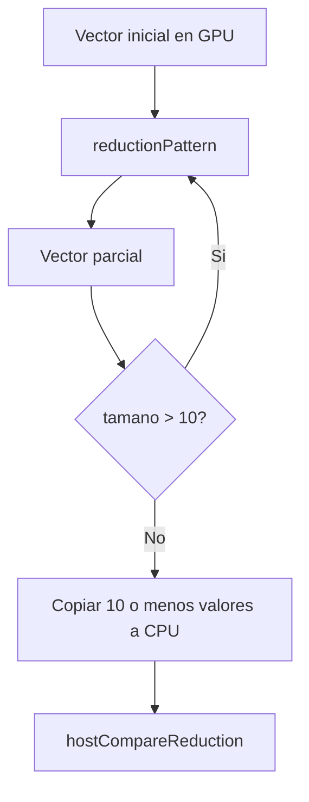

## 11.7. Variante 3.1: `reductionSimple`

Algoritmo:

- cada hilo lee `data[idx]`
- si es maximo -> `atomicMax(result, value)`
- si es minimo -> `atomicMin(result, value)`

### Caracteristicas

- extremadamente simple;
- no usa memoria compartida;
- alta contencion sobre `result`.

## 11.8. Variante 3.2: `reductionBasic`

Esta variante usa memoria compartida para una ventana:

- anterior
- actual
- siguiente

### Estructura

```mermaid
flowchart LR
    A[sharedWindow[0]] --> B[valor anterior al bloque]
    C[sharedWindow[1..blockDim]] --> D[valores actuales]
    E[sharedWindow[valid+1]] --> F[valor siguiente al bloque]
```

### Operacion local

Cada hilo calcula:

```text
best = compare(prev, current, next)
```

y luego publica `best` con atomoica global.

### Que aporta

- introduce shared memory;
- sigue siendo sencilla;
- simula una reduccion local por vecindad.

## 11.9. Variante 3.3: `reductionIntermediate`

Esta variante anade una segunda zona de shared memory:

- `sharedWindow`
- `sharedLocalBest`

Flujo:

1. cada hilo calcula su mejor local de la ventana
2. guarda ese valor en `sharedLocalBest`
3. solo los indices globales pares publican por parejas

### Diagrama

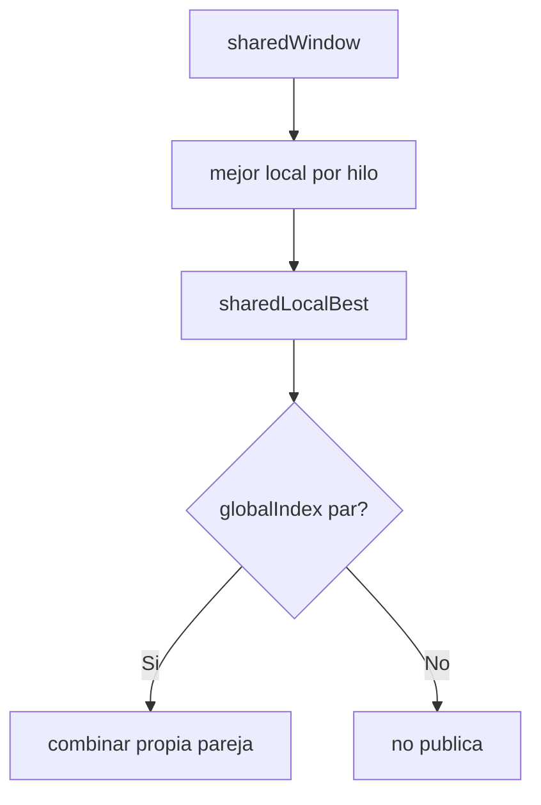

### Caso frontera

Si la pareja cruza el final del bloque, entra en juego
`computeWindowReductionFromGlobal()`, que recomputa el mejor local del vecino
leyendo memoria global.

## 11.10. Variante 3.4: `reductionPattern`

Es la reduccion clasica por mitades en shared memory.

### Codigo conceptual

```cpp
for (int stride = blockDim.x / 2; stride > 0; stride /= 2) {
    if (localIndex < stride) {
        sharedReduction[localIndex] =
            deviceCompareReduction(sharedReduction[localIndex],
                                   sharedReduction[localIndex + stride],
                                   isMax);
    }
    __syncthreads();
}
```

### Interpretacion matematica

En cada iteracion el numero de candidatos se divide entre 2:

- si hay 256 elementos
- luego 128
- luego 64
- luego 32
- ...
- hasta 1 parcial por bloque

### Diagrama

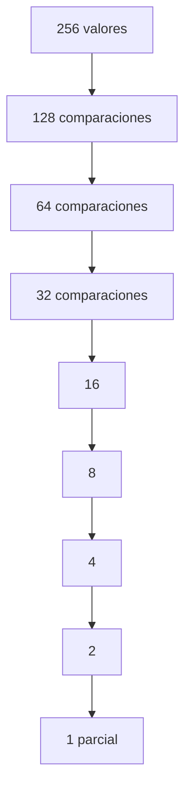

## 11.11. Comparacion entre variantes

| Variante | Memoria compartida | Atomicas globales | Idea principal |
|---|---|---|---|
| Simple | No | Si | Cada hilo publica directamente |
| Basica | Si | Si | Mejor de anterior-actual-siguiente |
| Intermedia | Si | Si | Mejor local + publicacion por parejas |
| Reduccion | Si | No | Reduccion por bloque y cierre iterativo |

---

## 12. Fase 04: histograma de aeropuertos

## 12.1. Objetivo

Contar ocurrencias por aeropuerto:

- origen
- destino

usando `SEQ_ID` en GPU y traduciendo a codigo solo en CPU.

## 12.2. Por que no se usan strings en GPU

Comparar y contar strings en GPU complicaria mucho:

- longitud variable;
- comparacion cara;
- mas trafico de memoria.

Por eso el programa trabaja con:

- `SEQ_ID` entero en GPU
- `codigo` textual solo al imprimir

## 12.3. `phase04`

Pasos:

1. decide si usar origen o destino
2. elige:
   - `denseInput`
   - `denseToSeqId`
   - `idToCode`
3. verifica `totalElements` y `totalBins`
4. verifica que el histograma cabe en shared memory
5. reserva:
   - `devicePartialHistograms`
   - `deviceFinalHistogram`
6. lanza `phase4SharedHistogramKernel`
7. lanza `phase4MergeHistogramKernel`
8. copia histograma a CPU
9. llama a `printPhase4Histogram`

## 12.4. `phase4SharedHistogramKernel`

Este kernel hace un histograma parcial por bloque.

### Flujo

1. reserva `sharedHistogram`
2. lo inicializa a cero por franjas
3. cada hilo procesa como mucho una fila
4. hace `atomicAdd(&sharedHistogram[denseIndices[globalIndex]], 1U)`
5. copia el histograma parcial del bloque a memoria global

### Diagrama

```mermaid
flowchart TD
    A[Hilos del bloque] --> B[sharedHistogram = 0]
    B --> C[Leer denseIndices[globalIndex]]
    C --> D[atomicAdd bin en shared]
    D --> E[Copiar sharedHistogram a partialHistograms]
```

## 12.5. `phase4MergeHistogramKernel`

Un hilo por bin:

- recorre todos los parciales de ese bin
- los suma
- escribe el resultado final

Formula:

```text
finalHistogram[bin] = sum(partialHistograms[partialIndex * totalBins + bin])
```

## 12.6. `printPhase4Histogram`

Esta funcion ya trabaja solo en CPU.

Hace tres tareas:

1. decide cuantos aeropuertos superan el umbral
2. calcula la longitud de cada barra
3. traduce `denseIndex -> seqId -> codigo`

### Escalado de barras

```text
barLength = histogram[denseIndex] * maxBarWidth / maximumShownCount
```

con:

- `maxBarWidth = 40`
- si `barLength == 0` y el conteo es positivo, fuerza `barLength = 1`

### Ejemplo

Si:

- `maximumShownCount = 200`
- `count = 50`

Entonces:

```text
barLength = 50 * 40 / 200 = 10
```

## 12.7. Diagrama completo de la Fase 04

```mermaid
flowchart TD
    A[g_originSeqId / g_destSeqId] --> B[buildDenseInput]
    B --> C[denseInput]
    B --> D[denseToSeqId]
    C --> E[phase4SharedHistogramKernel]
    E --> F[partialHistograms]
    F --> G[phase4MergeHistogramKernel]
    G --> H[finalHistogram]
    H --> I[printPhase4Histogram]
    D --> I
    J[idToCode] --> I
```

---

## 13. `kernels.cuh`: interfaz publica device

`kernels.cuh` expone lo que `main.cu` necesita conocer de la parte CUDA.

### Elementos declarados

- constante de tamano:
  - `kPhase2TailNumStride`
- helper host:
  - `copyPhase2ThresholdToConstant`
- helpers device:
  - `deviceCompareReduction`
- kernels:
  - `phase1DepartureDelayKernel`
  - `phase2ArrivalDelayKernel`
  - `reductionSimple`
  - `reductionBasic`
  - `reductionIntermediate`
  - `reductionPattern`
  - `phase4SharedHistogramKernel`
  - `phase4MergeHistogramKernel`

La cabecera no contiene implementacion, solo contratos.

---

## 14. `kernels.cu`: memoria y calculo en GPU

## 14.1. Memoria usada en este proyecto

| Tipo de memoria | Donde aparece | Para que se usa |
|---|---|---|
| Global | `d_depDelay`, `d_arrDelay`, `d_tailNums`, entradas y salidas | Dataset principal y resultados |
| Constante | `d_phase2Threshold` | Configuracion comun de Fase 02 |
| Compartida | `sharedWindow`, `sharedLocalBest`, `sharedReduction`, `sharedHistogram` | Reducciones e histograma |
| Host | vectores y mapas C++ | Carga, compactado, impresion |

### Diagrama de memorias

```mermaid
flowchart LR
    A[Host RAM] --> B[Global memory GPU]
    B --> C[Shared memory por bloque]
    D[Constante GPU] --> E[Fase 02]
    B --> F[Fase 01]
    B --> G[Fase 02]
    B --> H[Fase 03]
    B --> I[Fase 04]
```

## 14.1.1. Para que se usa cada tipo de memoria

### Memoria host

Es la memoria normal del programa C++:

- vive en RAM del sistema;
- la maneja la CPU;
- usa contenedores como `std::vector`, `std::string` y `std::unordered_map`.

En este proyecto se usa para:

- cargar el CSV;
- conservar el dataset completo;
- compactar Fase 03;
- traducir `SEQ_ID` a codigo en Fase 04;
- imprimir resultados.

### Memoria global de GPU

Es la memoria principal del dispositivo CUDA:

- accesible por todos los bloques y hilos;
- mas grande que la compartida;
- mas lenta que la compartida;
- ideal para guardar columnas completas del dataset.

Se usa para:

- `d_depDelay`
- `d_arrDelay`
- `d_tailNums`
- buffers de salida de Fase 02
- entradas densas de Fase 04
- parciales y resultados temporales de Fase 03 y Fase 04

### Memoria compartida

Es memoria local al bloque:

- rapida;
- pequena;
- visible solo para los hilos de un mismo bloque.

Se usa cuando los hilos del bloque colaboran, por ejemplo:

- ventana `anterior-actual-siguiente` en Fase 03 basica;
- mejores locales por pareja en Fase 03 intermedia;
- reduccion por mitades en Fase 03 patron;
- histograma parcial por bloque en Fase 04.

### Memoria constante

Es memoria de solo lectura para los kernels, escrita desde CPU:

- muy util cuando todos los hilos leen el mismo valor;
- evita repetir la misma configuracion en parametros y cargas globales.

En este proyecto se usa para:

- `d_phase2Threshold`

porque todos los hilos de Fase 02 comparan contra el mismo umbral.

## 14.1.2. Esquema de memoria por fase

| Fase | Host | Global GPU | Shared | Constante |
|---|---|---|---|---|
| 0 | CSV, vectores, mapas, resumen | No | No | No |
| 01 | CLI y lanzamiento | `d_depDelay` | No | No |
| 02 | CLI, recuperacion de salida | `d_arrDelay`, `d_tailNums`, buffers de salida | No | `d_phase2Threshold` |
| 03 | Compactado y cierre CPU de 3.4 | `deviceInput`, `deviceResult`, `devicePartials` | Si | No |
| 04 | Impresion textual | `d_originDenseInput` o `d_destinationDenseInput`, parciales, final | Si | No |

## 14.1.3. Ciclo de vida de la memoria en el proyecto

```mermaid
flowchart TD
    A[CSV en disco] --> B[Memoria host C++]
    B --> C[subirDatasetAGPU]
    C --> D[Global GPU reutilizable]
    D --> E[Fase 01]
    D --> F[Fase 02]
    D --> G[Fase 04]
    B --> H[Compactado temporal Fase 03]
    H --> I[Buffers temporales Fase 03]
    D --> J[liberarGPU]
    I --> J
```

## 14.1.4. Como se reserva y libera memoria

### `cudaMalloc`

`cudaMalloc` reserva memoria en la GPU.

Ejemplo conceptual:

```cpp
cudaMalloc(reinterpret_cast<void**>(&d_depDelay), delayBytes);
```

Esto significa:

- `d_depDelay` pasara a apuntar a un bloque de memoria device;
- el tamano reservado es `delayBytes`;
- esa memoria no contiene datos validos hasta que se copie algo dentro.

### `cudaFree`

`cudaFree` libera un bloque reservado antes con `cudaMalloc`.

En el proyecto suele ir seguido de:

```cpp
d_depDelay = nullptr;
```

para dejar claro que el puntero ya no apunta a memoria valida.

### `cudaMemcpy`

`cudaMemcpy` copia datos entre host y device.

En este proyecto aparecen sobre todo tres patrones:

#### 1. Host -> Device

```cpp
cudaMemcpy(d_depDelay, dataset.depDelay.data(), delayBytes, cudaMemcpyHostToDevice);
```

Se usa para subir columnas o buffers ya preparados.

#### 2. Device -> Host

```cpp
cudaMemcpy(&resultCount, d_phase2Count, sizeof(int), cudaMemcpyDeviceToHost);
```

Se usa para recuperar:

- contadores;
- resultados de reduccion;
- histogramas;
- vectores de salida.

#### 3. Device -> Device

No es el patron principal de este proyecto. La mayor parte de los datos se
mueven entre host y device, no entre dos buffers device distintos.

### `cudaMemset`

Se usa para inicializar a cero un buffer GPU, por ejemplo el contador de
resultados de Fase 02:

```cpp
cudaMemset(d_phase2Count, 0, sizeof(int));
```

### `cudaMemcpyToSymbol`

Sirve para copiar desde CPU a una variable `__constant__`:

```cpp
cudaMemcpyToSymbol(d_phase2Threshold, &threshold, sizeof(int));
```

Es la forma tipica de rellenar memoria constante.

## 14.1.5. Como interactuan host y device

La CPU nunca "toca" directamente la memoria GPU como si fuera RAM normal. La
interaccion siempre se hace por APIs CUDA.

Secuencia general:

1. CPU construye datos en RAM.
2. CPU reserva memoria device con `cudaMalloc`.
3. CPU copia datos con `cudaMemcpy`.
4. CPU lanza un kernel.
5. GPU ejecuta en paralelo.
6. CPU sincroniza.
7. CPU recupera resultados con `cudaMemcpy`.

En otras palabras:

- la CPU prepara y coordina;
- la GPU calcula;
- la CPU vuelve a presentar resultados.

## 14.1.6. Funciones base de C/C++ usadas en el proyecto

### `std::vector`

Es el contenedor base del proyecto. Se usa para:

- columnas del dataset;
- buffers temporales;
- vectores de parciales;
- histogramas en CPU.

Su papel es importante porque permite:

- almacenamiento contiguo;
- acceso por indice;
- pasar `data()` a `cudaMemcpy`.

### `std::string`

Se usa para:

- rutas;
- matriculas;
- codigos de aeropuerto;
- mensajes de error.

No se usa dentro de GPU. Antes de cruzar a device, se transforma a buffer
lineal de `char`.

### `std::unordered_map`

Se usa como tabla hash para:

- `SEQ_ID -> codigo`
- `SEQ_ID -> denseIndex`

Su ventaja aqui es que la busqueda media es cercana a O(1), lo que simplifica
mucho la densificacion y la traduccion de IDs.

### `std::getline`

Es la base de la entrada por consola y de la lectura del CSV:

- en CLI evita dejar restos de buffer de `std::cin`;
- en el CSV permite leer una linea completa antes de trocearla.

### `std::stringstream`

Se usa en la CLI para parsear texto introducido por el usuario y detectar si el
contenido es realmente un entero limpio o lleva basura extra.

Ejemplo:

```cpp
std::stringstream parser(input);
int parsedValue = 0;
char trailingCharacter = '\0';
```

La funcion comprueba:

- que se pudo leer un entero;
- que no queda ningun caracter sobrante.

### `std::stof`

Convierte texto a `float` en `parseFloatOrNan`.

Se combina con:

- manejo de excepciones;
- verificacion del numero de caracteres consumidos.

### `std::isnan`

Es fundamental en host para detectar datos ausentes:

- al contar faltantes;
- al compactar Fase 03.

### `static_cast<int>`

Se usa para truncar `float` a `int`.

En este proyecto no se redondea: se trunca hacia cero.

Ejemplos:

- `4.9 -> 4`
- `-4.9 -> -4`

## 14.1.7. Funciones base de CUDA usadas en el proyecto

### `cudaGetDeviceCount`

Comprueba si hay GPU CUDA disponible.

### `cudaGetDeviceProperties`

Lee:

- nombre de GPU;
- compute capability;
- memoria global;
- memoria compartida por bloque;
- maximo de hilos por bloque.

Es la base de `queryGpuInfo()` y `computeLaunchConfig()`.

### `cudaGetLastError`

Detecta si el lanzamiento del kernel fue correcto.

### `cudaDeviceSynchronize`

Bloquea a la CPU hasta que el kernel termina. Sin esto:

- no se sabria si el kernel fallo realmente;
- los `printf` device podrian no haberse vaciado aun;
- las copias de resultados podrian ejecutarse demasiado pronto.

### `atomicAdd`

Aparece en:

- `phase2ArrivalDelayKernel`
- `phase4SharedHistogramKernel`

Se usa cuando varios hilos escriben sobre un mismo contador o bin.

### `atomicMax` y `atomicMin`

Aparecen en Fase 03 para variantes con acumulador global. Garantizan que la
actualizacion del resultado no se corrompa cuando muchos hilos compiten.

## 14.2. `matchesSignedThreshold`

Unifica la logica de Fases 01 y 02:

- `threshold >= 0` -> retrasos
- `threshold < 0` -> adelantos

Eso evita duplicar el mismo `if` en dos kernels.

## 14.3. `deviceCompareReduction`

Unifica la comparacion max/min dentro de GPU:

- si `isMax`, devuelve el mayor;
- si no, devuelve el menor.

## 14.4. `computeWindowReductionFromGlobal`

Es un helper puntual para la variante intermedia. Solo se usa cuando una pareja
cruza el limite de bloque. En vez de asumir que el vecino no existe, vuelve a
leer memoria global para construir correctamente su ventana local.

---

## 15. Llamadas entre funciones

## 15.1. Grafo general

```mermaid
flowchart TD
    A[main] --> B[queryGpuInfo]
    A --> C[printGpuSummary]
    A --> D[promptAndLoadDataset]
    D --> E[cargarDataset]
    E --> F[loadDataset]
    E --> G[subirDatasetAGPU]
    A --> H[phase01]
    A --> I[phase02]
    A --> J[phase03]
    A --> K[phase04]
    H --> L[phase1DepartureDelayKernel]
    I --> M[copyPhase2ThresholdToConstant]
    I --> N[phase2ArrivalDelayKernel]
    J --> O[phase03AtomicVariant]
    J --> P[phase03ReductionVariant]
    O --> Q[reductionSimple / reductionBasic / reductionIntermediate]
    P --> R[reductionPattern]
    K --> S[phase4SharedHistogramKernel]
    K --> T[phase4MergeHistogramKernel]
```

## 15.2. Mapa por responsabilidades

| Funcion | Tipo | Papel |
|---|---|---|
| `loadDataset` | Host | Leer y limpiar CSV |
| `subirDatasetAGPU` | Host | Construir estado persistente en GPU |
| `phase01` | Host | Orquestar Fase 01 |
| `phase02` | Host | Orquestar Fase 02 |
| `phase03` | Host | Orquestar Fase 03 |
| `phase04` | Host | Orquestar Fase 04 |
| `phase1DepartureDelayKernel` | Device | Filtro simple de salida |
| `phase2ArrivalDelayKernel` | Device | Filtro con salida compactada |
| `reduction*` | Device | Variantes de reduccion |
| `phase4*HistogramKernel` | Device | Histograma parcial y merge |

---

## 16. Decisiones de implementacion

## 16.1. Globals simples en `main.cu`

Se ha elegido un estilo global porque:

- reduce firmas largas;
- evita structs de estado complejos;
- hace mas directo seguir el flujo del programa;
- se parece a una implementacion academica facil de defender.

## 16.2. Umbral firmado en Fases 01 y 02

Se ha preferido:

- un solo entero

en lugar de:

- modo + umbral

porque reduce parsing y simplifica la interfaz interna.

## 16.3. `WEATHER_DELAY` solo en Fase 03

No se sube fijo a GPU porque:

- solo participa en Fase 03;
- Fase 03 ya compacta la columna elegida;
- subirla siempre no aporta suficiente beneficio.

## 16.4. Densificacion de `SEQ_ID`

Se ha elegido densificar porque:

- evita histogramas dispersos;
- reduce memoria;
- mantiene exactitud;
- facilita shared memory en Fase 04.

## 16.5. Fase 03 con cuatro variantes siempre

Esto no es lo mas corto, pero si es fiel a la practica:

- permite comparar resultados;
- permite estudiar distintos patrones CUDA;
- deja visible el sentido didactico de la fase.

## 16.6. Sin `std::sort` en Fase 04

La salida conserva el orden de descubrimiento de los bins densos. Es una
decision de simplicidad:

- menos codigo;
- menos postprocesado;
- salida estable respecto al flujo del dataset.

## 16.7. Reflexiones tecnicas cortas

### Sobre la simplicidad

La arquitectura actual no intenta esconder el programa tras demasiadas capas.
Eso hace que algunas cosas sean menos elegantes, pero tambien hace mas visible:

- donde vive cada dato;
- cuando se sube a GPU;
- cuando se libera;
- que fase usa cada columna.

### Sobre el equilibrio host/GPU

El proyecto no envia todo a GPU ni deja todo en CPU. Hace una mezcla bastante
razonable para una practica:

- dataset base compartido en GPU para fases repetidas;
- `WEATHER_DELAY` y compactado de Fase 03 en CPU por simplicidad;
- impresion final en CPU, donde tiene sentido.

### Sobre el coste real de las fases

No todas las fases cuestan igual:

- Fase 01 es muy ligera;
- Fase 02 ya introduce compaccion y atomicas;
- Fase 03 es la parte mas didactica y mas variada;
- Fase 04 mezcla preprocesado host y colaboracion por bloque.

### Sobre la documentacion del codigo

Una idea importante al estudiar este proyecto es no verlo solo como "un
programa que funciona", sino como un conjunto de patrones CUDA pequenos:

- indexacion 1D;
- filtrado con umbral;
- compaccion con contador atomico;
- reducciones por distintas estrategias;
- histogramas con shared memory.

---

## 17. Resumen final por fase

| Fase | Entrada principal | Trabajo host | Trabajo GPU | Salida |
|---|---|---|---|---|
| 0 | CSV | Lectura, limpieza, resumen | Ninguno | Dataset y resumen |
| 01 | `DEP_DELAY` | Lanzamiento | Filtro firmado e impresion | Consola |
| 02 | `ARR_DELAY`, `TAIL_NUM` | Lanzamiento, copia de salida | Filtro firmado, compactacion, atomicas | Consola + resumen CPU |
| 03 | `DEP_DELAY`, `ARR_DELAY`, `WEATHER_DELAY` | Compactado, copia temporal, cierre final variante 3.4 | Cuatro reducciones | Consola |
| 04 | `SEQ_ID` densificados | Preparacion densa, dibujo textual | Histograma parcial + merge | Consola |

---

## 18. Como leer el proyecto de forma recomendada

Si alguien quiere entender el codigo actual en el mejor orden posible, la ruta
de lectura recomendada es:

1. `csv_reader.h`
2. `csv_reader.cpp`
3. globals y helpers iniciales de `main.cu`
4. `subirDatasetAGPU`
5. `kernels.cuh`
6. `kernels.cu`
7. `phase01`
8. `phase02`
9. `phase03`
10. `phase04`
11. `main()`

Ese orden sigue la vida real de los datos: disco -> host -> GPU -> fases ->
salida.

---

## 20. Conclusiones tecnicas

El proyecto actual sigue una estrategia muy concreta:

- carga y limpia solo lo necesario;
- mantiene el dataset base en host;
- sube a GPU solo las columnas reutilizadas;
- compacta la entrada de Fase 03 por ejecucion;
- trabaja con kernels 1D sencillos;
- usa shared memory donde la practica realmente lo pide;
- intenta mantenerse simple a nivel de estructuras y flujo host.

Su arquitectura no busca ser la mas abstracta ni la mas profesional, sino una
arquitectura defendible en un contexto academico:

- facil de seguir;
- con decisiones visibles;
- con un reparto claro entre CPU y GPU;
- y con implementaciones suficientemente simples para estudiar cada fase.
