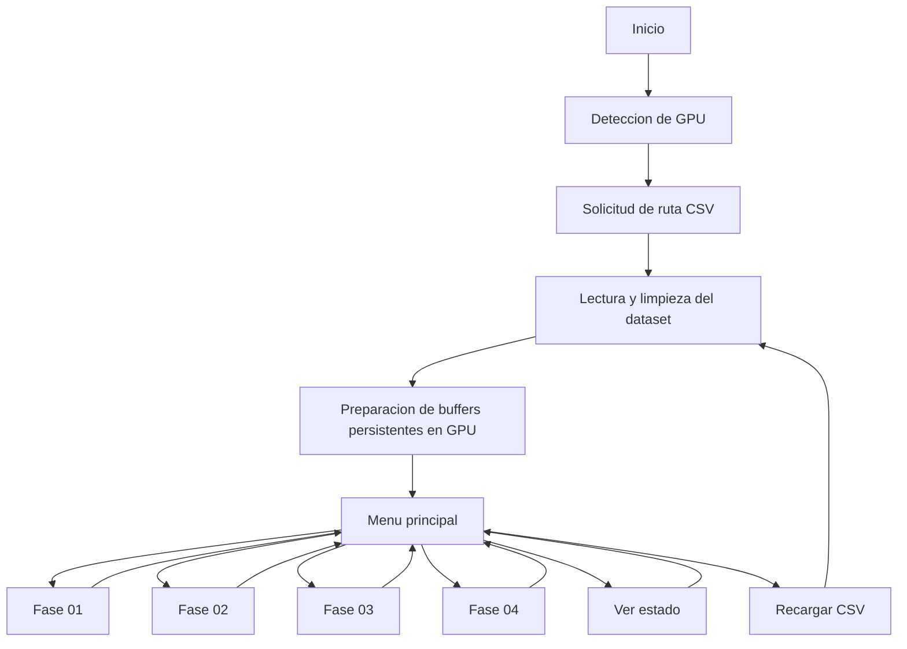
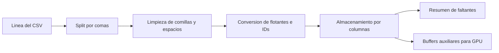
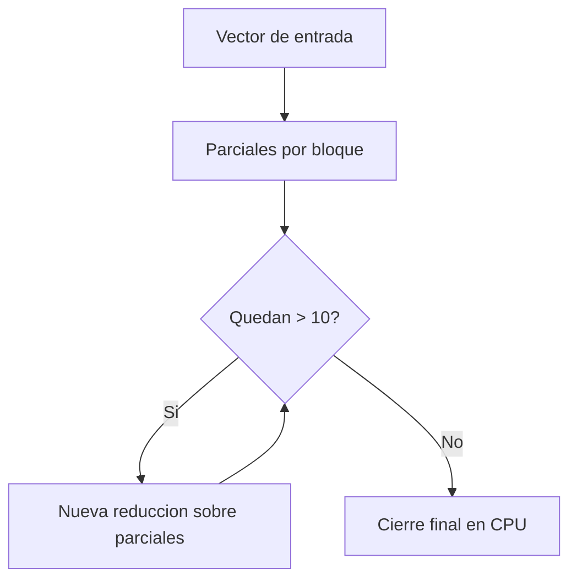

# Memoria PL1 CUDA

## Paradigmas Avanzados de Programacion

**Universidad de Alcala**  
**PECL1 - Programacion con CUDA**  
**Proyecto:** `pap_air`  
**Formato actual:** borrador amplio en Markdown para recorte posterior a PDF  

---

## 1. Introduccion

El objetivo de esta practica es desarrollar una aplicacion en C/C++ con CUDA capaz de procesar un conjunto de datos real de vuelos comerciales de Estados Unidos. La aplicacion debe cargar un fichero CSV, limpiar los datos relevantes y ejecutar varias fases de analisis en GPU usando un esquema de acceso linealizado 1D, tal y como exige el enunciado.

La implementacion desarrollada en `pap_air` sigue una idea sencilla: mantener una parte del trabajo en CPU para la lectura del fichero, la preparacion de estructuras auxiliares y la presentacion final por consola, y trasladar a GPU las partes de computo masivas de cada fase. De este modo, el programa conserva una estructura defendible en un contexto universitario, sin recurrir a librerias externas ni a patrones avanzados de CUDA que no se pedian en la practica.

Las fases obligatorias que resuelve la aplicacion son las siguientes:

1. Deteccion de retrasos o adelantos en salidas usando `DEP_DELAY`.
2. Deteccion de retrasos o adelantos en llegadas usando `ARR_DELAY` y `TAIL_NUM`.
3. Obtencion del maximo o minimo retraso usando cuatro variantes de reduccion.
4. Generacion de un histograma de aeropuertos de origen o destino.

Ademas, la aplicacion incorpora una Fase 0 previa de lectura, limpieza y preparacion del CSV. Aunque esta fase no se evalua como una fase de computo independiente, es fundamental porque condiciona por completo la calidad y la coherencia de los datos sobre los que se ejecutan las fases CUDA.

---

## 2. Objetivo general y enfoque del proyecto

El planteamiento del proyecto ha sido cumplir los requisitos marcados por el enunciado utilizando implementaciones claras y directas. Las decisiones principales han sido:

- usar solo C/C++ estandar y CUDA Runtime;
- mantener el acceso a datos en GPU mediante indexacion lineal 1D;
- separar la lectura del CSV del computo CUDA;
- utilizar memoria global, memoria compartida y memoria constante solo cuando realmente aportan a las fases pedidas;
- evitar abstracciones excesivamente complejas.

El resultado final es una aplicacion de consola que:

- detecta la GPU disponible;
- solicita la ruta del dataset;
- carga y limpia el CSV;
- sube a GPU las estructuras que se reutilizan;
- ofrece un menu interactivo para ejecutar cada fase;
- muestra resultados tanto desde GPU como desde CPU, segun lo que pide cada apartado.

---

## 3. Conjunto de datos y limpieza previa

El proyecto trabaja sobre el dataset `Airline_dataset.csv`, un fichero CSV con informacion de vuelos. El enunciado no exige cargar todas las columnas del fichero, sino un subconjunto concreto de ellas. En esta implementacion se han utilizado las columnas necesarias para cubrir correctamente las fases del ejercicio:

- `TAIL_NUM`
- `ORIGIN_SEQ_ID`
- `ORIGIN_AIRPORT`
- `DEST_SEQ_ID`
- `DEST_AIRPORT`
- `DEP_DELAY`
- `ARR_DELAY`
- `WEATHER_DELAY`

La lectura del CSV se realiza en [`csv_reader.cpp`](/mnt/c/Users/05jan/Desktop/Tareas/Uni/3_Curso/2_cuatri/Paradigmas_avanzados_de_programacion/Lab/pap_air/PL1_CUDA/src/csv_reader.cpp) mediante la funcion `loadDataset(...)`. El diseño de esta fase es deliberadamente simple:

1. Se abre el fichero y se descarta la cabecera.
2. Se procesa cada linea una unica vez.
3. Se separan los campos con `splitCsvLineSimple(...)`.
4. Se limpian comillas y espacios con `cleanQuotedToken(...)`.
5. Se convierten los numericos con `parseFloatOrNan(...)`.
6. Los IDs de aeropuerto se convierten con `parseIntFromFloatToken(...)`.
7. Se almacenan los datos ya limpios en memoria host.

### 3.1. Politica de limpieza aplicada

La limpieza no intenta ser una validacion compleja del fichero, sino una preparacion consistente para poder trabajar despues con CUDA:

- si una fila tiene menos columnas de las esperadas, se descarta;
- si un dato numerico no puede convertirse, se guarda como `NAN`;
- si un `SEQ_ID` no puede convertirse, se guarda como `-1`;
- si una cadena esta vacia, se conserva vacia;
- si un aeropuerto tiene `SEQ_ID` valido y codigo no vacio, se guarda su relacion en un mapa `ID -> codigo`.

Esto permite que las fases posteriores distingan entre valores validos y ausentes sin perder el alineamiento entre columnas.

### 3.2. Estructura del dataset en memoria host

La estructura principal del host es `DatasetColumns`, declarada en [`csv_reader.h`](/mnt/c/Users/05jan/Desktop/Tareas/Uni/3_Curso/2_cuatri/Paradigmas_avanzados_de_programacion/Lab/pap_air/PL1_CUDA/src/csv_reader.h). Se trata de un almacenamiento por columnas:

- `std::vector<float> depDelay`
- `std::vector<float> arrDelay`
- `std::vector<float> weatherDelay`
- `std::vector<std::string> tailNum`
- `std::vector<int> originSeqId`
- `std::vector<int> destSeqId`
- `std::unordered_map<int, std::string> originIdToCode`
- `std::unordered_map<int, std::string> destIdToCode`

El almacenamiento por columnas resulta adecuado porque cada fase trabaja con un subconjunto concreto del dataset. De este modo, no hace falta extraer valores de una estructura por filas mas pesada, sino acceder directamente a la columna necesaria.

### 3.3. Resumen de carga

La estructura `LoadSummary` resume el comportamiento de la fase de lectura:

- filas leidas;
- filas almacenadas;
- filas descartadas;
- valores ausentes por columna relevante;
- numero de aeropuertos unicos por `SEQ_ID` en origen y destino.

Este resumen no es solo informativo. Tambien ayuda a verificar que el dataset se ha procesado correctamente y que las fases posteriores van a ejecutarse sobre datos razonables.

---

## 4. Arquitectura general de la aplicacion

La aplicacion se divide en tres bloques principales:

- [`main.cu`](/mnt/c/Users/05jan/Desktop/Tareas/Uni/3_Curso/2_cuatri/Paradigmas_avanzados_de_programacion/Lab/pap_air/PL1_CUDA/src/main.cu): flujo general, consola, subida de datos a GPU y orquestacion de fases.
- [`csv_reader.h`](/mnt/c/Users/05jan/Desktop/Tareas/Uni/3_Curso/2_cuatri/Paradigmas_avanzados_de_programacion/Lab/pap_air/PL1_CUDA/src/csv_reader.h) y [`csv_reader.cpp`](/mnt/c/Users/05jan/Desktop/Tareas/Uni/3_Curso/2_cuatri/Paradigmas_avanzados_de_programacion/Lab/pap_air/PL1_CUDA/src/csv_reader.cpp): lectura y limpieza del CSV.
- [`kernels.cuh`](/mnt/c/Users/05jan/Desktop/Tareas/Uni/3_Curso/2_cuatri/Paradigmas_avanzados_de_programacion/Lab/pap_air/PL1_CUDA/src/kernels.cuh) y [`kernels.cu`](/mnt/c/Users/05jan/Desktop/Tareas/Uni/3_Curso/2_cuatri/Paradigmas_avanzados_de_programacion/Lab/pap_air/PL1_CUDA/src/kernels.cu): implementacion device de las fases.

### 4.1. Flujo general del programa

### 4.2. Estado global del programa

En vez de utilizar una gran estructura de estado, `main.cu` mantiene variables globales simples:

- dataset en host: `g_dataset`
- resumen de carga: `g_summary`
- ruta actual: `g_datasetPath`
- indicadores de estado: `g_datasetLoaded`, `g_deviceReady`
- propiedades de la GPU: `g_deviceProp`
- punteros de memoria device para Fases 01, 02 y 04

Esta decision simplifica el paso de informacion entre funciones. A nivel academico, la ventaja es que el flujo resulta mas facil de seguir: casi todas las funciones operan sobre un mismo estado visible y no necesitan firmas con demasiados parametros.

---

## 5. Uso de memoria y comunicacion host-device

Una parte importante de la practica es justificar como se utiliza la memoria de CUDA. En el proyecto aparecen cuatro espacios de memoria principales:

### 5.1. Memoria host

Es la memoria principal de la CPU. En ella se almacenan:

- las columnas del dataset leido;
- los mapas `SEQ_ID -> codigo`;
- los buffers intermedios que se construyen antes de copiar a GPU;
- los resultados que deben mostrarse desde CPU.

### 5.2. Memoria global

Es la memoria principal de la GPU. Se usa para:

- `d_depDelay` en Fase 01;
- `d_arrDelay` en Fase 02;
- `d_tailNums` para las matriculas;
- `d_phase2Count`, `d_phase2OutDelayValues`, `d_phase2OutTailNums`;
- `d_originDenseInput` y `d_destinationDenseInput` en Fase 04;
- vectores temporales de entrada y salida en Fase 03.

La memoria global tiene la ventaja de permitir acceso desde cualquier hilo, aunque es mas lenta que la memoria compartida.

### 5.3. Memoria compartida

Se utiliza en dos contextos:

- Fase 03, variantes basica e intermedia;
- Fase 04, histograma parcial por bloque.

Su objetivo es reducir accesos repetidos a memoria global y permitir cooperacion entre hilos de un mismo bloque.

### 5.4. Memoria constante

Se usa en Fase 02 para almacenar el umbral firmado mediante `copyPhase2ThresholdToConstant(...)`. Todos los hilos leen el mismo valor, asi que tiene sentido situarlo en memoria constante.

### 5.5. Tabla de memoria por fase

| Fase | Datos base | Memoria principal | Observacion |
|---|---|---|---|
| Fase 0 | CSV y resumen | Host | Lectura, limpieza y preparacion |
| Fase 01 | `DEP_DELAY` | Global | Un hilo por fila |
| Fase 02 | `ARR_DELAY`, `TAIL_NUM`, umbral | Global + Constante | Salida paralela con `atomicAdd` |
| Fase 03 | Columna elegida compactada a `int` | Global + Compartida | Cuatro variantes |
| Fase 04 | Bins densos por `SEQ_ID` | Global + Compartida | Histograma parcial y fusion |

### 5.6. Operaciones CUDA utilizadas

Las operaciones principales de gestion de memoria son:

- `cudaMalloc`: reserva memoria en GPU;
- `cudaMemcpy`: copia datos entre host y device;
- `cudaMemset`: inicializa memoria device;
- `cudaMemcpyToSymbol`: copia a memoria constante;
- `cudaFree`: libera memoria device.

El flujo habitual es:

1. reservar memoria device;
2. copiar datos desde host;
3. lanzar el kernel;
4. sincronizar;
5. recuperar resultados si hace falta;
6. liberar memoria temporal.

---

## 6. Fase 0: lectura, limpieza y preparacion

La Fase 0 es la base del resto del proyecto. Aunque el enunciado pone el foco en las fases CUDA, la lectura del CSV es imprescindible para que todas ellas trabajen con datos consistentes.

### 6.1. Funciones principales implicadas

- `loadDataset(...)`
- `splitCsvLineSimple(...)`
- `cleanQuotedToken(...)`
- `parseFloatOrNan(...)`
- `parseIntFromFloatToken(...)`
- `buildTailBuffer(...)`
- `buildDenseInput(...)`
- `subirDatasetAGPU(...)`
- `printLoadSummary()`

### 6.2. Pipeline de preparacion

### 6.3. Preparacion especifica para GPU

No todas las columnas suben a GPU de la misma forma:

- `DEP_DELAY` y `ARR_DELAY` se copian como vectores de `float`;
- `TAIL_NUM` se linealiza a un buffer de `char` con stride fijo;
- los `SEQ_ID` de origen y destino se densifican a indices consecutivos;
- `WEATHER_DELAY` no se mantiene de forma persistente en GPU, porque solo se usa en Fase 03 y se prepara por ejecucion.

#### Linealizacion de `TAIL_NUM`

La funcion `buildTailBuffer(...)` convierte un vector de matriculas de longitud variable en una matriz linealizada de celdas de longitud fija `kPhase2TailNumStride = 16`. Matematicamente, la celda de la fila `i` comienza en:

\[
\text{base}(i) = i \cdot 16
\]

De esta forma, la matricula de la fila `i` puede recuperarse directamente en GPU como:

\[
\text{tailNumIn} + i \cdot 16
\]

#### Densificacion de `SEQ_ID`

La funcion `buildDenseInput(...)` transforma IDs dispersos en bins consecutivos:

\[
SEQ\_ID \rightarrow denseIndex \in [0, N_{bins}-1]
\]

Esta aproximacion evita reservar histogramas gigantes por rango bruto de IDs y reduce mucho el consumo de memoria en Fase 04.

---

## 7. Fase 01: retraso en despegues

La Fase 01 trabaja con la columna `DEP_DELAY`. Cada hilo procesa una posicion del vector y comprueba si el valor supera un umbral firmado.

### 7.1. Funcion host

La funcion host es `phase01(int threshold)` en [`main.cu`](/mnt/c/Users/05jan/Desktop/Tareas/Uni/3_Curso/2_cuatri/Paradigmas_avanzados_de_programacion/Lab/pap_air/PL1_CUDA/src/main.cu). Su trabajo es:

1. calcular la configuracion de lanzamiento con `computeLaunchConfig(...)`;
2. mostrar por consola la configuracion usada;
3. lanzar `phase1DepartureDelayKernel(...)`;
4. sincronizar y comprobar errores con `ejecutarKernelYEsperar(...)`.

### 7.2. Kernel device

El kernel implicado es `phase1DepartureDelayKernel(...)` en [`kernels.cu`](/mnt/c/Users/05jan/Desktop/Tareas/Uni/3_Curso/2_cuatri/Paradigmas_avanzados_de_programacion/Lab/pap_air/PL1_CUDA/src/kernels.cu). Su logica es:

1. calcular el indice global:

\[
idx = blockIdx.x \cdot blockDim.x + threadIdx.x
\]

2. comprobar si el hilo esta dentro del rango;
3. leer el valor `delayValues[idx]`;
4. ignorar el dato si es `NAN`;
5. truncar `float` a `int`;
6. aplicar el filtro firmado.

### 7.3. Regla matematica del umbral

El proyecto usa umbral firmado, tal y como acepta el enunciado:

- si `threshold >= 0`, se buscan retrasos:

\[
delay \ge threshold
\]

- si `threshold < 0`, se buscan adelantos:

\[
delay \le threshold
\]

Por ejemplo:

- umbral `60` detecta vuelos con `DEP_DELAY >= 60`;
- umbral `-15` detecta vuelos con `DEP_DELAY <= -15`.

### 7.4. Resultado y salida

Cuando una fila cumple la condicion, el hilo imprime directamente:

- su identificador global;
- si es retraso o adelanto;
- el numero de minutos detectado.

Se trata de la fase mas sencilla del proyecto y sirve como introduccion a un patron muy claro: un hilo por elemento, un acceso lineal, una condicion y una salida directa.

---

## 8. Fase 02: retraso en aterrizajes

La Fase 02 es similar en espiritu a la anterior, pero incluye informacion adicional: no solo se estudia `ARR_DELAY`, sino tambien la matricula `TAIL_NUM` asociada a cada vuelo.

### 8.1. Funcion host

La fase se implementa desde `phase02(int threshold)` en [`main.cu`](/mnt/c/Users/05jan/Desktop/Tareas/Uni/3_Curso/2_cuatri/Paradigmas_avanzados_de_programacion/Lab/pap_air/PL1_CUDA/src/main.cu). Esta funcion realiza:

1. calculo de configuracion de lanzamiento;
2. inicializacion del contador device con `cudaMemset`;
3. copia del umbral a memoria constante con `copyPhase2ThresholdToConstant(...)`;
4. lanzamiento del kernel;
5. sincronizacion;
6. copia a CPU del numero de resultados encontrados;
7. copia a CPU de retrasos y matriculas detectadas;
8. impresion del resumen final con `printPhase2HostSummary(...)`.

### 8.2. Uso de memoria constante

El umbral se almacena en `d_phase2Threshold`, una variable `__constant__`. Esto tiene sentido porque:

- todos los hilos leen el mismo valor;
- no cambia durante el kernel;
- evita pasarlo como parametro repetido en cada acceso.

La copia se hace con:

`cudaMemcpyToSymbol(d_phase2Threshold, &threshold, sizeof(int))`

### 8.3. Kernel de la Fase 02

El kernel `phase2ArrivalDelayKernel(...)` realiza:

1. calculo del indice global 1D;
2. comprobacion de rango;
3. lectura de `ARR_DELAY`;
4. descarte si el valor es `NAN`;
5. truncado a entero;
6. comparacion con el umbral firmado;
7. reserva de posicion de salida con `atomicAdd(outCount, 1)`;
8. copia del retraso a `outDelayValues[outputIndex]`;
9. copia de la matricula a `outTailNumBuffer`.

### 8.4. Papel de `atomicAdd`

Si varios hilos encuentran resultados a la vez, todos necesitan escribir en un buffer de salida compartido. Para evitar colisiones, cada hilo ejecuta:

\[
outputIndex = atomicAdd(outCount, 1)
\]

Esto garantiza que cada hilo reciba una posicion unica. El precio es que el orden de llegada no esta garantizado: los resultados se almacenan segun el orden en que las operaciones atomicas se resuelven en GPU, no necesariamente segun el orden original del dataset.

### 8.5. Resumen CPU final

La practica pide que se muestre el conteo y la informacion de los vuelos detectados. Para ello, tras acabar el kernel:

- se copia `outCount` a CPU;
- se copian los retrasos y matriculas reales encontrados;
- se imprimen uno a uno en `printPhase2HostSummary(...)`.

Esta fase combina muy bien dos mundos:

- GPU para el filtrado masivo;
- CPU para una salida ordenada y comprensible al usuario.

---

## 9. Fase 03: reduccion de retraso

La Fase 03 es la parte mas rica desde el punto de vista de programacion paralela. Permite calcular el maximo o el minimo sobre tres posibles columnas:

- `DEP_DELAY`
- `ARR_DELAY`
- `WEATHER_DELAY`

### 9.1. Preparacion comun

La funcion `phase03(int columnOption, int reductionOption)`:

1. selecciona la columna fuente;
2. decide si la reduccion es maximo o minimo;
3. ignora valores `NAN`;
4. compacta los datos validos a un `std::vector<int>`;
5. copia ese vector a GPU;
6. ejecuta las cuatro variantes;
7. imprime los cuatro resultados.

El compactado es importante porque evita que los kernels trabajen con valores no validos. El vector final tiene longitud:

\[
N = \text{numero de elementos validos}
\]

### 9.2. Operacion de comparacion comun

La comparacion comun se encapsula en:

- `deviceCompareReduction(...)` en device;
- `hostCompareReduction(...)` en host.

Si se busca maximo:

\[
compare(a, b) = \max(a, b)
\]

Si se busca minimo:

\[
compare(a, b) = \min(a, b)
\]

La identidad de reduccion es:

- `INT_MIN` para maximos;
- `INT_MAX` para minimos.

### 9.3. Variante 3.1: reduccion simple

Implementada con `reductionSimple(...)`.

Cada hilo:

1. lee su posicion;
2. aplica una unica operacion atomica global;
3. actualiza el acumulador final.

Es la variante mas directa y la que mas contencion puede generar, pero tambien la mas facil de explicar.

### 9.4. Variante 3.2: reduccion basica

Implementada con `reductionBasic(...)`.

Cada hilo observa tres posiciones:

- anterior;
- actual;
- siguiente.

Para ello se usa memoria compartida como ventana local del bloque. La estructura es:

La memoria compartida contiene `blockDim.x + 2` enteros, porque se reserva un halo a izquierda y otro a derecha. Despues de cargar la ventana, cada hilo calcula su mejor valor local y lo publica mediante `atomicMax` o `atomicMin`.

### 9.5. Variante 3.3: reduccion intermedia

Implementada con `reductionIntermediate(...)`.

Esta variante reutiliza la misma idea de ventana compartida, pero anade un segundo nivel:

1. cada hilo calcula su mejor entre anterior, actual y siguiente;
2. ese mejor se guarda en memoria compartida;
3. solo los hilos de indice global par combinan su mejor con el del hilo siguiente;
4. el resultado se publica de forma atomica en memoria global.

Esta estrategia reduce el numero de escrituras atomicas finales respecto a la basica.

### 9.6. Variante 3.4: patron de reduccion

Implementada con `reductionPattern(...)` y gestionada desde `phase03ReductionVariant(...)`.

Es la variante mas cercana a una reduccion clasica por bloques:

1. cada hilo carga un valor en memoria compartida;
2. se ejecuta una reduccion por strides decrecientes;
3. el hilo 0 del bloque escribe un parcial;
4. el host vuelve a lanzar la reduccion sobre el vector de parciales;
5. se repite hasta que quedan 10 valores o menos;
6. el cierre final se hace en CPU.

### 9.7. Justificacion tecnica

La Fase 03 no solo busca el resultado final, sino comparar diferentes estrategias de reduccion:

- una muy simple con contencion atomica;
- dos variantes intermedias con memoria compartida;
- una reduccion por patron mas estructurada.

Por eso la implementacion no se limita a una unica solucion, sino que conserva las cuatro salidas que pide el enunciado.

---

## 10. Fase 04: histograma de aeropuertos

La Fase 04 construye un histograma de vuelos por aeropuerto de origen o destino.

### 10.1. Decision principal: trabajar con `SEQ_ID`

En GPU no se trabaja directamente con cadenas de texto, sino con:

- `ORIGIN_SEQ_ID` o `DEST_SEQ_ID`

Los codigos de aeropuerto (`ORIGIN_AIRPORT`, `DEST_AIRPORT`) se usan solo en CPU para mostrar la salida final. Esta decision simplifica el kernel, porque operar sobre enteros es mucho mas natural que operar sobre strings dentro de GPU.

### 10.2. Densificacion de categorias

Los `SEQ_ID` no se usan como indices directos, sino que se densifican:

Si un aeropuerto tiene `SEQ_ID = 11298` y otro `SEQ_ID = 14321`, eso no significa que haya que reservar un vector completo hasta 14321. En su lugar:

- el primero puede mapearse a bin `0`;
- el segundo a bin `1`;
- etc.

Asi se obtiene un histograma compacto de `N_bins` categorias reales.

### 10.3. Funcion host

La fase se lanza desde `phase04(int airportOption, int threshold)`. Esta funcion:

1. elige origen o destino;
2. toma el vector denso ya preparado;
3. comprueba si el histograma cabe en memoria compartida;
4. reserva histograma parcial y final en GPU;
5. lanza el kernel parcial;
6. lanza el kernel de fusion;
7. copia el histograma final a CPU;
8. imprime el histograma textual.

### 10.4. Kernel parcial

`phase4SharedHistogramKernel(...)` usa memoria compartida por bloque:

1. inicializa un histograma local en shared memory;
2. cada hilo incrementa el bin correspondiente a su fila valida;
3. al terminar, el bloque copia su histograma parcial a memoria global.

Este esquema reduce la contencion frente a actualizar directamente un histograma global desde todos los hilos.

### 10.5. Kernel de fusion

`phase4MergeHistogramKernel(...)` recorre los histogramas parciales y suma, para cada bin, el total de todos los bloques:

\[
finalHistogram[bin] = \sum_{p=0}^{partialCount-1} partialHistograms[p, bin]
\]

### 10.6. Filtrado e impresion

El filtrado por umbral minimo se hace en CPU, tal y como permite el enunciado. La funcion `printPhase4Histogram(...)`:

- calcula el maximo mostrado;
- escala las barras a un ancho maximo de 40 caracteres;
- imprime solo los bins con recuento suficiente.

La longitud de barra se calcula como:

\[
barLength = \frac{count \cdot 40}{maximumShownCount}
\]

Si un aeropuerto debe mostrarse pero la escala da 0, se fuerza al menos una almohadilla `#` para que tenga representacion visual.

---

## 11. Interfaz de usuario y flujo de control

La aplicacion ofrece una interfaz de consola sencilla pero informativa. El archivo central es [`main.cu`](/mnt/c/Users/05jan/Desktop/Tareas/Uni/3_Curso/2_cuatri/Paradigmas_avanzados_de_programacion/Lab/pap_air/PL1_CUDA/src/main.cu), cuyo `main()` sigue este flujo:

1. imprimir cabecera;
2. detectar GPU con `queryGpuInfo()`;
3. mostrar resumen CUDA;
4. solicitar dataset con `promptAndLoadDataset(...)`;
5. entrar en el menu principal;
6. ejecutar una fase, ver estado, recargar o salir.

### 11.1. Funciones auxiliares de consola

- `trimWhitespace(...)`: limpia espacios al principio y al final.
- `fileExists(...)`: comprueba si una ruta existe.
- `isCancelToken(...)`: reconoce `X` o `x`.
- `pauseForEnter()`: detiene la ejecucion hasta pulsar Intro.
- `readIntegerInRange(...)`: lee opciones enteras acotadas.
- `readSignedThreshold(...)`: lee un umbral firmado.

Estas funciones no hacen calculo cientifico, pero son importantes porque mantienen una interaccion clara y evitan errores de entrada en el menu.

---

## 12. Funciones clave del codigo

Aunque la memoria no pretende describir cada linea, si conviene dejar claro el papel de las funciones mas relevantes:

### 12.1. Carga y preparacion

- `loadDataset(...)`: lee y limpia el CSV.
- `buildTailBuffer(...)`: linealiza matriculas en celdas fijas.
- `buildDenseInput(...)`: construye bins densos para histogramas.
- `subirDatasetAGPU(...)`: reserva y copia los datos persistentes a GPU.

### 12.2. Soporte CUDA

- `queryGpuInfo()`: detecta la GPU y sus propiedades.
- `computeLaunchConfig(...)`: calcula bloques e hilos por bloque.
- `cudaOk(...)`: compacta la comprobacion de errores CUDA.
- `ejecutarKernelYEsperar(...)`: verifica lanzamiento y sincroniza.

### 12.3. Fases

- `phase01(...)`: filtro firmado sobre `DEP_DELAY`.
- `phase02(...)`: filtro firmado sobre `ARR_DELAY` y resumen CPU.
- `phase03(...)`: orquesta las cuatro reducciones.
- `phase04(...)`: construye el histograma por aeropuerto.

### 12.4. Kernels

- `phase1DepartureDelayKernel(...)`
- `phase2ArrivalDelayKernel(...)`
- `reductionSimple(...)`
- `reductionBasic(...)`
- `reductionIntermediate(...)`
- `reductionPattern(...)`
- `phase4SharedHistogramKernel(...)`
- `phase4MergeHistogramKernel(...)`

---

## 13. Decisiones de implementacion

Durante el desarrollo se tomaron varias decisiones para equilibrar simplicidad, correccion y cumplimiento del enunciado.

### 13.1. Almacenamiento por columnas

Se eligio almacenar el dataset por columnas porque cada fase accede a un subconjunto distinto de datos. Esto evita estructuras por fila mas pesadas y simplifica la copia a GPU.

### 13.2. Uso de datos persistentes en GPU

Las columnas reutilizadas por Fases 01, 02 y 04 se suben una sola vez. Esto evita repetir `cudaMalloc` y `cudaMemcpy` en cada ejecucion del menu.

### 13.3. `WEATHER_DELAY` solo en host

No se mantiene de forma persistente en GPU porque solo se usa en Fase 03. En este caso resulta mas simple compactar la columna al ejecutar la fase que reservar otra estructura fija innecesaria.

### 13.4. Umbral firmado en Fases 01 y 02

Se eligio una interfaz con un solo numero entero firmado porque permite expresar tanto retrasos como adelantos de manera directa, sin introducir un segundo parametro extra.

### 13.5. Densificacion de `SEQ_ID`

La Fase 04 podria haberse implementado con un histograma por rango bruto de IDs, pero eso habria provocado mucho consumo innecesario de memoria. La densificacion permite conservar la correctitud con una estructura mucho mas razonable.

---

## 14. Reflexiones tecnicas breves

Desde un punto de vista academico, el proyecto muestra bien varias ideas fundamentales de CUDA:

- el paralelismo masivo es especialmente natural en fases de filtrado simple como Fase 01;
- cuando hay escritura concurrente, las atomicas se vuelven necesarias, como en Fase 02;
- la memoria compartida tiene sentido cuando varios hilos de un bloque reutilizan informacion cercana, como en Fase 03 y Fase 04;
- no todo debe resolverse en GPU: CPU sigue siendo adecuada para lectura de ficheros, compactado sencillo, resumenes y presentacion por consola.

Tambien se observa que no siempre la solucion mas compleja es la mas apropiada. En un contexto universitario, una implementacion clara, comentada y bien defendible puede ser mas valiosa que una optimizacion agresiva dificil de explicar.

---

## 15. Conclusiones

El proyecto `pap_air` resuelve las cuatro fases obligatorias del enunciado apoyandose en una Fase 0 de carga y limpieza del dataset. La aplicacion combina CPU y GPU de forma coherente:

- CPU se encarga de la lectura del CSV, la preparacion de estructuras y la presentacion final;
- GPU realiza el procesado paralelo masivo de las fases pedidas.

Cada fase utiliza una tecnica distinta:

- filtrado simple por umbral en Fase 01;
- filtrado con salida paralela y memoria constante en Fase 02;
- reducciones con varias estrategias en Fase 03;
- histogramas por categorias densificadas en Fase 04.

En conjunto, la implementacion cumple el objetivo de la practica y sirve como ejemplo de aplicacion progresiva de conceptos CUDA: memoria global, memoria compartida, memoria constante, operaciones atomicas, reducciones y construccion de histogramas.

Como posibles mejoras futuras, sin salir del espiritu del ejercicio, se podrian considerar:

1. una comparacion experimental mas detallada entre las cuatro variantes de reduccion;
2. una medicion temporal de cada fase en `Debug` y `Release`;
3. una version final mas compacta de esta memoria ajustada estrictamente a las 10 paginas del PDF entregable.

---

## 16. Relacion con el enunciado

La memoria propuesta se ajusta a lo que pide el apartado de documentacion del enunciado:

- comenta los detalles clave de la implementacion;
- explica como se ha hecho cada fase;
- describe como se computan los resultados;
- identifica los datos utilizados;
- justifica varias decisiones tecnicas;
- deja una base amplia para recortar despues a la version PDF de un maximo de 10 paginas.

Por tanto, este borrador no es aun la version final de entrega, pero si una base completa y tecnicamente alineada con la practica real implementada.
