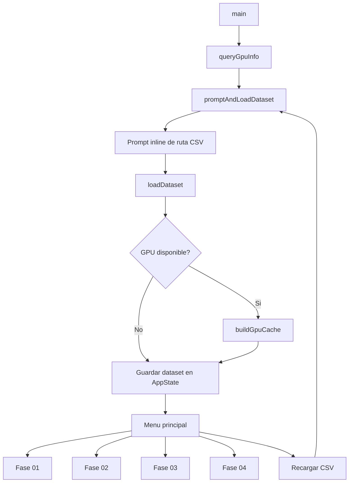

# pap_air

## Estado actual

El proyecto implementa la practica completa sobre el **US Airline Dataset**:

- **Fase 0**: lectura y limpieza del CSV.
- **Fase 01**: filtrado CUDA sobre `DEP_DELAY`.
- **Fase 02**: filtrado CUDA sobre `ARR_DELAY` y `TAIL_NUM`.
- **Fase 03**: cuatro variantes de reduccion sobre `DEP_DELAY`,
  `ARR_DELAY` y `WEATHER_DELAY`.
- **Fase 04**: histograma CUDA de aeropuertos por `SEQ_ID`.

La version actual se ha simplificado para reducir codigo host y evitar copias
repetidas. Las Fases 01, 02 y 04 reutilizan una **cache persistente en GPU**
que se construye una sola vez al cargar el CSV.

---

## Estructura del proyecto

- `PL1_CUDA/src/csv_reader.h` y `csv_reader.cpp`
  - cargan el CSV;
  - limpian solo las columnas que usa hoy la practica;
  - generan un resumen corto de la carga.
- `PL1_CUDA/src/kernels.cuh` y `kernels.cu`
  - contienen los kernels de Fases 01, 02, 03 y 04.
- `PL1_CUDA/src/main.cu`
  - coordina la aplicacion;
  - mantiene el estado global;
  - contiene toda la interfaz de consola;
  - construye la cache persistente de GPU;
  - ejecuta todas las fases.

Dataset de ejemplo:

- `PL1_CUDA/src/data/Airline_dataset.csv`

---

## Modelo de datos actual

El dataset en host se guarda en `DatasetColumns` y ya no conserva columnas que
la practica actual no usa.

### Columnas almacenadas por fila

- `depDelay`
- `arrDelay`
- `weatherDelay`
- `tailNum`
- `originSeqId`
- `destSeqId`

### Mapas auxiliares

- `originIdToCode`
- `destIdToCode`

Estos mapas permiten imprimir el codigo de aeropuerto en la Fase 04 sin tener
que mantener dos columnas string completas por fila.

### Resumen de carga

`LoadSummary` conserva solo lo imprescindible:

- filas leidas;
- filas almacenadas;
- filas descartadas;
- faltantes en `TAIL_NUM`, `ORIGIN_SEQ_ID`, `ORIGIN_AIRPORT`,
  `DEST_SEQ_ID`, `DEST_AIRPORT`, `DEP_DELAY`, `ARR_DELAY` y
  `WEATHER_DELAY`;
- aeropuertos unicos por `SEQ_ID` en origen y destino.

---

## Flujo real del programa

1. `main()` imprime el banner.
2. Se detecta la GPU CUDA.
3. Se pide la ruta del CSV.
4. `loadDataset(...)` carga el fichero en host.
5. Si hay GPU, `buildGpuCache(...)` crea la cache persistente.
6. Se muestra un resumen corto de carga y CUDA.
7. El programa entra en el menu principal.

### Diagrama de flujo

### Explicacion

- La captura del menu, de la ruta del CSV y de los parametros de cada fase
  vive inline dentro de `main.cu`, sin helpers de CLI separados.
- `loadDataset(...)` deja el dataset limpio en memoria del host.
- `buildGpuCache(...)` copia solo lo que conviene reutilizar muchas veces:
  - `DEP_DELAY`
  - `ARR_DELAY`
  - `TAIL_NUM`
  - entradas densas de la Fase 04
  - buffers de salida persistentes de la Fase 02
- La Fase 03 no se cachea porque su entrada cambia segun la columna y el tipo
  de reduccion elegidos.

---

## Cache persistente en GPU

La cache `GpuCache` existe para evitar repetir `cudaMalloc` y `cudaMemcpy` en
cada ejecucion de fase.

### Que guarda

- `d_depDelay`
- `d_arrDelay`
- `d_tailNums`
- `d_phase2Count`
- `d_phase2OutDelayValues`
- `d_phase2OutTailNums`
- `origin.d_denseInput`
- `destination.d_denseInput`

### Impacto

- **Fase 01** ya no reconstruye enteros ni mascaras de validez en host.
- **Fase 02** ya no vuelve a copiar `ARR_DELAY` ni `TAIL_NUM` en cada uso.
- **Fase 04** ya no recompone los bins densos en cada ejecucion.

---

## Que hace cada fase

### Fase 01

- usa `DEP_DELAY`;
- pide `retraso`, `adelanto` o `ambos`;
- pide un umbral `>= 0`;
- el kernel trabaja directamente sobre `float` en GPU;
- si el valor no es `NAN`, lo trunca a `int` y aplica el filtro.

### Fase 02

- usa `ARR_DELAY` y `TAIL_NUM`;
- pide `retraso`, `adelanto` o `ambos`;
- el modo y el umbral se copian a **memoria constante**;
- el kernel usa `atomicAdd` para reservar huecos en la salida;
- al terminar, la CPU recupera el contador, los retrasos y las matriculas.

### Fase 03

- permite elegir:
  - `DEP_DELAY`
  - `ARR_DELAY`
  - `WEATHER_DELAY`
- permite elegir:
  - `Maximo`
  - `Minimo`
- ejecuta siempre las cuatro variantes:
  - `Simple`
  - `Basica`
  - `Intermedia`
  - `Reduccion`

La CPU compacta la columna elegida ignorando `NAN`, la copia a GPU y lanza las
cuatro variantes seguidas.

### Fase 04

- permite elegir `origen` o `destino`;
- trabaja con `SEQ_ID`, no con strings;
- usa una entrada densa persistente ya preparada en la carga;
- genera un histograma parcial por bloque en memoria compartida;
- fusiona los parciales en un segundo kernel;
- la CPU dibuja el histograma textual final.

---

## Que se procesa en CPU y que se procesa en GPU

### CPU

- lectura del CSV;
- limpieza basica de texto y numeros;
- construccion del resumen de carga;
- construccion inicial de la cache persistente;
- compactado de datos para la Fase 03;
- impresion del histograma textual de la Fase 04;
- menu y captura de parametros.

### GPU

- filtrado de Fase 01;
- filtrado y devolucion de resultados de Fase 02;
- cuatro reducciones de Fase 03;
- histograma compartido + fusion de Fase 04.

---

## Configuracion local de CUDA

El proyecto esta pensado para **Visual Studio 2022**.

Si `CUDA_PATH` no basta para que Visual Studio encuentre la instalacion
correcta, copiar:

- `PL1_CUDA/cuda.local.props.example`

a:

- `PL1_CUDA/cuda.local.props`

y ajustar:

- `CudaBuildCustomizationVersion`
- `CudaToolkitCustomDir`

Ese archivo local esta ignorado por git.

---

## Resumen rapido del flujo interno

- `csv_reader.*` carga el CSV.
- `main.cu` gestiona la consola, guarda el dataset y construye la cache GPU.
- `kernels.cu` contiene toda la logica device.

La idea de esta version es simple:

- menos wrappers;
- menos estado redundante;
- menos copias host -> device;
- misma cobertura funcional de la practica.
