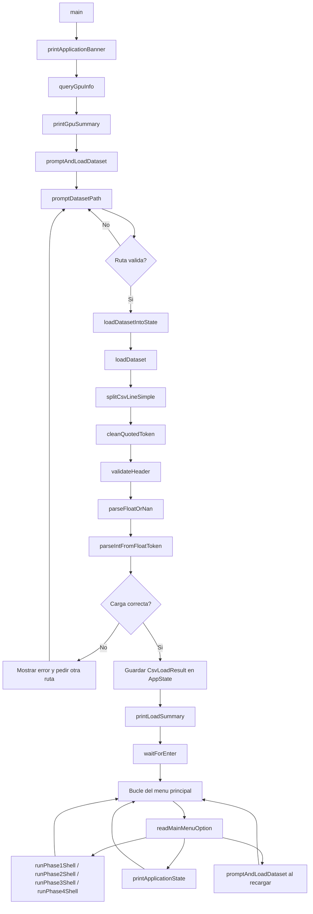

# pap_air

## Estado actual del proyecto

Este repositorio contiene una practica academica de **CUDA C/C++** basada en el
**US Airline Dataset**. En el estado actual del codigo, las partes realmente
implementadas son la **Fase 0**, la **Fase 01**, la **Fase 02**, la
**Fase 03** y la **Fase 04**:

- lectura del CSV desde disco;
- limpieza basica y validacion de cabecera;
- carga del dataset en memoria del host usando una estructura por columnas;
- calculo de estadisticas de calidad de datos;
- deteccion del hardware CUDA disponible;
- interfaz de consola completa y navegable para las Fases 1-4;
- filtrado CUDA de `DEP_DELAY` para la Fase 01;
- filtrado CUDA de `ARR_DELAY` + `TAIL_NUM` para la Fase 02;
- reducciones CUDA de maximo/minimo sobre `DEP_DELAY`, `ARR_DELAY` y
  `WEATHER_DELAY` para la Fase 03;
- histograma CUDA de aeropuertos sobre `ORIGIN_SEQ_ID` y `DEST_SEQ_ID` para la
  Fase 04.

---

## Estructura del proyecto

El proyecto principal es `PL1_CUDA` y los archivos mas importantes son:

- `PL1_CUDA/src/main.cu`
  - coordina el flujo general de la aplicacion;
  - mantiene el estado global en memoria;
  - llama al lector CSV;
  - consulta la GPU;
  - gestiona el menu principal y los submenus.
- `PL1_CUDA/src/csv_reader.h`
  - declara las estructuras de datos de la Fase 0;
  - declara las funciones de lectura, limpieza y validacion.
- `PL1_CUDA/src/csv_reader.cpp`
  - implementa la carga del CSV;
  - limpia texto y numeros;
  - genera estadisticas de faltantes y categorias unicas.
- `PL1_CUDA/src/cli_utils.h`
  - declara enums y funciones auxiliares de la interfaz por consola.
- `PL1_CUDA/src/cli_utils.cpp`
  - implementa menus, lectura segura de opciones y pausas entre pantallas.
- `PL1_CUDA/src/kernels.cuh`
  - declara los kernels de Fase 01, Fase 02, Fase 03 y Fase 04.
- `PL1_CUDA/src/kernels.cu`
  - implementa los kernels CUDA actuales del proyecto.
- `PL1_CUDA/cuda.local.props.example`
  - plantilla de configuracion local para la version de CUDA de cada miembro.

Tambien existe un CSV de ejemplo en:

- `PL1_CUDA/src/data/Airline_dataset.csv`

---

## Configuracion local de Visual Studio y CUDA

El proyecto esta pensado para abrirse en **Visual Studio 2022** y permitir que
cada desarrollador use su propia version de CUDA sin reescribir el
`PL1_CUDA.vcxproj`.

### Preparacion inicial en cada equipo

1. Abrir `PL1_CUDA.sln` con Visual Studio 2022.
2. Intentar compilar directamente si la variable de entorno `CUDA_PATH` ya
   apunta a la instalacion correcta de CUDA.
3. Si Visual Studio no detecta bien la version, copiar
   `PL1_CUDA/cuda.local.props.example` a `PL1_CUDA/cuda.local.props`.
4. Editar `cuda.local.props` y ajustar:
   - `CudaBuildCustomizationVersion`
   - `CudaToolkitCustomDir`
5. Comprobar que ambas propiedades apuntan a la misma instalacion de CUDA.
6. Si Visual Studio intenta reutilizar un binario antiguo, hacer `Clean
   Solution`, borrar `PL1_CUDA/x64/` si hace falta y volver a compilar.

### Ejemplo de configuracion local

```xml
<Project xmlns="http://schemas.microsoft.com/developer/msbuild/2003">
  <PropertyGroup>
    <CudaBuildCustomizationVersion>12.6</CudaBuildCustomizationVersion>
    <CudaToolkitCustomDir>$(CUDA_PATH_V12_6)</CudaToolkitCustomDir>
  </PropertyGroup>
</Project>
```

Notas importantes:

- `PL1_CUDA/cuda.local.props` esta ignorado por git y es opcional.
- Si `CUDA_PATH` esta bien definido, el proyecto intenta deducir
  automaticamente la version de CUDA desde esa variable.
- Cada miembro del equipo puede tener valores distintos en ese archivo.
- El proyecto fallara con un mensaje claro solo si no puede deducir CUDA o si
  la version indicada no existe en `BuildCustomizations`.
- El directorio de trabajo del depurador se fija a `$(ProjectDir)` para que las
  rutas relativas del CSV se resuelvan siempre desde `PL1_CUDA/`.

---

## Que hace hoy la aplicacion

Cuando se ejecuta el programa, el flujo actual es este:

1. `main()` imprime un banner inicial.
2. `main()` llama a `queryGpuInfo(...)`.
3. Si hay una GPU CUDA accesible, se muestran sus propiedades basicas.
4. `main()` llama a `promptAndLoadDataset(...)`.
5. `promptAndLoadDataset(...)` usa `promptDatasetPath(...)` para pedir la ruta
   del CSV y proponer `src/data/Airline_dataset.csv` como ruta por defecto si
   existe.
6. Cuando el usuario elige una ruta, `loadDatasetIntoState(...)` llama a
   `loadDataset(...)`.
7. `loadDataset(...)` abre el CSV, valida la cabecera, recorre el fichero fila
   a fila y construye un `DatasetColumns`.
8. Al terminar la carga, `main()` muestra el resumen de Fase 0.
9. El programa entra en un menu persistente con las opciones de las cuatro
   fases, recarga del CSV, estado y salida.
10. Si el usuario entra en Fase 01 o Fase 02, la aplicacion prepara buffers en
    host, lanza el kernel y muestra los resultados.
11. Si el usuario entra en Fase 03, la aplicacion compacta la columna elegida,
    la copia a GPU y ejecuta las cuatro variantes de reduccion.
12. Si el usuario entra en Fase 04, la aplicacion construye bins densos a
    partir de `SEQ_ID`, genera el histograma en GPU y lo dibuja en CPU.

En otras palabras:

- la **CPU** gestiona lectura, limpieza, validacion, estado, menus y
  preparacion de buffers;
- la **GPU** ya ejecuta los kernels de Fase 01, Fase 02, Fase 03 y Fase 04;
- la CPU sigue encargandose de la carga del CSV y del postprocesado final.

---

## Modelo de datos actual

La estructura central de la Fase 0 es `DatasetColumns`, definida en
`csv_reader.h`.

En lugar de guardar una estructura por fila, el proyecto guarda una **columna
por vector**, lo cual facilita mucho las fases CUDA posteriores.

### Columnas almacenadas

- `depDelay`
- `arrDelay`
- `weatherDelay`
- `depTime`
- `arrTime`
- `tailNum`
- `originSeqId`
- `destSeqId`
- `originAirport`
- `destAirport`

### Reglas de limpieza

- Si un campo numerico falta o no puede convertirse, se guarda como `NAN`.
- Si un texto falta, se guarda como `""`.
- Si un identificador entero falta, se guarda `-1`.
- Todas las columnas deben quedar alineadas por indice.

Esto significa que el indice `i` representa siempre la misma fila logica en
todas las columnas.

---

## Como funciona el lector CSV

La funcion central es:

```cpp
CsvLoadResult loadDataset(const std::string& filename);
```

### Flujo interno de `loadDataset`

1. Intenta abrir el fichero.
2. Lee la cabecera.
3. Divide la cabecera en tokens con `splitCsvLineSimple(...)`.
4. Limpia cada token con `cleanQuotedToken(...)`.
5. Valida que las columnas esperadas esten donde deben con `validateHeader(...)`.
6. Recorre el resto del fichero linea a linea.
7. Para cada fila:
   - divide la linea en tokens;
   - descarta la fila si tiene menos columnas de las esperadas;
   - limpia campos de texto;
   - convierte numericos con `parseFloatOrNan(...)`;
   - convierte IDs enteros con `parseIntFromFloatToken(...)`;
   - actualiza contadores de faltantes;
   - almacena la fila en `DatasetColumns`.
8. Al final:
   - calcula el numero de aeropuertos unicos por `SEQ_ID` y por codigo;
   - verifica que todas las columnas tengan el mismo tamano;
   - devuelve un `CsvLoadResult`.

### Funciones auxiliares del lector

- `splitCsvLineSimple(...)`
  - parser CSV simple sin librerias externas;
  - soporta comillas basicas, comas dentro de campos quoted y campos vacios.
- `cleanQuotedToken(...)`
  - recorta espacios y elimina comillas envolventes.
- `parseFloatOrNan(...)`
  - convierte un token a `float`;
  - devuelve `NAN` si el dato no existe o no es valido.
- `parseIntFromFloatToken(...)`
  - convierte tokens como `1129806.0` a entero truncado;
  - usa `-1` como centinela si el dato falta.
- `validateHeader(...)`
  - comprueba que el fichero cargado coincide con el formato esperado.

### Estructuras de apoyo del lector

- `CsvLoadStats`
  - guarda filas leidas, filas almacenadas, filas descartadas, faltantes y
    conteos de aeropuertos por `SEQ_ID` y por codigo.
- `CsvLoadResult`
  - agrupa el dataset, las estadisticas, la ruta procesada y un mensaje de
    error si algo falla.

### Aclaracion importante sobre los aeropuertos unicos

El dataset real da dos cifras distintas y ambas son correctas:

- `375` codigos de aeropuerto unicos;
- `409` `SEQ_ID` unicos.

La diferencia existe porque hay codigos como `ORD`, `DAL` o `BZN` que aparecen
con mas de un `SEQ_ID`. La Fase 04 trabaja con `SEQ_ID`, por eso el criterio
principal del estado inicial pasa a ser `409`.

---

## Como funciona la interfaz de consola

La capa de consola esta en `cli_utils.*`.

### Objetivo de `cli_utils`

Separar del `main` todo lo relacionado con:

- impresion de menus;
- lectura segura de opciones;
- validacion de enteros;
- seleccion de ruta del CSV;
- cancelacion con `X`;
- pausas entre pantallas.

### Funciones mas importantes

- `printApplicationBanner()`
  - muestra el encabezado inicial del programa.
- `printMainMenu()`
  - imprime el menu principal.
- `promptDatasetPath(...)`
  - pide la ruta del CSV;
  - si detecta `src/data/Airline_dataset.csv`, la ofrece como valor por
    defecto.
- `readMainMenuOption()`
  - convierte la entrada del usuario en un `MainMenuOption`.
- `readDelayFilterModeOption(...)`
  - pide `retraso`, `adelanto` o `ambos`;
  - si el usuario pulsa Intro, selecciona `ambos`.
- `readBoundedIntOption(...)`
  - valida opciones numericas dentro de un rango cerrado.
- `waitForEnter()`
  - pausa la ejecucion para que el usuario pueda leer la pantalla.

### Opciones actuales del menu

- `1` Fase 01 - Retraso en salida
- `2` Fase 02 - Retraso en llegada
- `3` Fase 03 - Reduccion de retraso
- `4` Fase 04 - Histograma de aeropuertos
- `R` Recargar CSV
- `I` Ver estado de la aplicacion
- `X` Salir

### Submenus actuales

Cada fase ya tiene su propia pantalla de entrada:

- Fase 01
  - pide tipo de filtro y umbral para `DEP_DELAY`.
- Fase 02
  - pide tipo de filtro y umbral para `ARR_DELAY`.
- Fase 03
  - pide columna y tipo de reduccion.
- Fase 04
  - pide origen/destino y umbral minimo.

Comportamiento actual de los submenus:

- Fase 01
  - ejecuta el kernel de filtrado sobre `DEP_DELAY`.
- Fase 02
  - ejecuta el kernel de filtrado sobre `ARR_DELAY` y devuelve resultados al
    host.
- Fase 03
  - ejecuta las cuatro variantes obligatorias de reduccion.
- Fase 04
  - ejecuta el histograma de aeropuertos usando `SEQ_ID` densos en GPU.

---

## Como funciona `main.cu`

`main.cu` es el orquestador del proyecto.

### Tipos importantes definidos en `main.cu`

- `LaunchConfig`
  - guarda `blocks` y `threadsPerBlock`.
- `AppState`
  - guarda:
    - ruta del dataset activa;
    - estado de carga del CSV;
    - `CsvLoadResult`;
    - estado CUDA;
    - propiedades del dispositivo detectado.

### Funciones principales de `main.cu`

- `buildDatasetCandidates(...)`
  - construye la lista de rutas candidatas del CSV;
  - prioriza la ultima ruta usada y la ruta local `src/data/Airline_dataset.csv`.
- `queryGpuInfo(...)`
  - consulta si hay GPU CUDA y rellena `cudaDeviceProp`.
- `computeLaunchConfig(...)`
  - calcula una configuracion sugerida:
    - hasta 256 hilos por bloque;
    - numero de bloques suficiente para cubrir el dataset.
- `printLoadSummary(...)`
  - imprime el resumen de limpieza del CSV.
- `printGpuSummary(...)`
  - imprime el resumen del hardware CUDA.
- `printApplicationState(...)`
  - combina estado del dataset y estado CUDA.
- `loadDatasetIntoState(...)`
  - llama a `loadDataset(...)` y actualiza `AppState`.
- `promptAndLoadDataset(...)`
  - controla el ciclo completo de preguntar ruta e intentar cargar.
- `printSuggestedLaunchConfigIfAvailable(...)`
  - muestra una configuracion futura de lanzamiento para el dataset cargado.
- `runPhase1Shell(...)`
  - pide tipo de filtro y umbral;
  - ejecuta la Fase 01.
- `runPhase2Shell(...)`
  - pide tipo de filtro y umbral;
  - ejecuta la Fase 02.
- `runPhase3Shell(...)`
  - pide columna y tipo de reduccion;
  - compacta la columna elegida;
  - ejecuta las cuatro variantes de Fase 03.
- `runPhase4Shell(...)`
  - pide origen/destino y umbral minimo;
  - construye bins densos por `SEQ_ID`;
  - ejecuta el histograma real de Fase 04.

### Flujo de llamadas real



### Explicacion del flujo

- `main()` inicia la aplicacion, consulta la GPU y fuerza una carga inicial del
  dataset antes de mostrar el menu.
- `promptAndLoadDataset()` controla la interaccion con el usuario para elegir
  la ruta del CSV y repetir el intento si la carga falla.
- `loadDatasetIntoState()` hace de puente entre el lector CSV y la aplicacion:
  llama a `loadDataset(...)` y, si todo va bien, copia el resultado dentro de
  `AppState`.
- `loadDataset()` ejecuta toda la Fase 0 en CPU:
  - abre el fichero;
  - valida la cabecera;
  - trocea cada linea;
  - limpia tokens;
  - convierte numeros y textos;
  - almacena el dataset limpio en memoria del host.
- Las funciones `splitCsvLineSimple(...)`, `cleanQuotedToken(...)`,
  `validateHeader(...)`, `parseFloatOrNan(...)` y
  `parseIntFromFloatToken(...)` son helpers internos del lector y se ejecutan
  durante esa carga.
- Cuando la carga termina bien, el resultado queda guardado en
  `appState.loadResult`, de forma que el menu y las fases futuras reutilizan el
  dataset sin volver a leer el CSV.
- Las Fases 01, 02, 03 y 04 preparan sus buffers desde
  `appState.loadResult.dataset` y lanzan sus kernels sin recargar el fichero.

---

## Kernels actuales

El archivo `kernels.cu` mantiene estos kernels:

```cpp
__global__ void phase1DepartureDelayKernel(...);
__global__ void phase2ArrivalDelayKernel(...);
__global__ void reductionBasic(...);
__global__ void reductionIntermediate(...);
__global__ void reductionPattern(...);
__global__ void reductionSimple(int* data, int* result, int n, bool isMax);
__global__ void phase4SharedHistogramKernel(...);
__global__ void phase4MergeHistogramKernel(...);
```

### Que hace cada kernel

- `phase1DepartureDelayKernel`
  - mira una posicion de `DEP_DELAY`;
  - ignora `NAN` usando una mascara de validez;
  - aplica `retraso`, `adelanto` o `ambos` segun el modo elegido;
  - imprime hilo global y valor detectado.
- `phase2ArrivalDelayKernel`
  - mira una posicion de `ARR_DELAY`;
  - lee modo y umbral desde memoria constante;
  - usa `atomicAdd` para reservar hueco en la salida;
  - guarda retraso y matricula en arrays simples;
  - imprime hilo global, matricula y tipo detectado.
- `reductionSimple`
  - implementa la variante 3.1 simple.
- `reductionBasic`
  - implementa la variante 3.2 basica con ventana anterior-actual-siguiente
    en memoria compartida.
- `reductionIntermediate`
  - implementa la variante 3.3 intermedia con mejor valor local en memoria
    compartida y publicacion por parejas desde hilos pares.
- `reductionPattern`
  - implementa la variante 3.4 de patron de reduccion por bloques y genera
    vectores parciales para reducciones sucesivas.
- `phase4SharedHistogramKernel`
  - construye un histograma parcial por bloque en memoria compartida.
- `phase4MergeHistogramKernel`
  - fusiona los parciales del histograma compartido.

---

## Que se procesa en CPU y que se procesa en GPU

### Hoy en CPU

- lectura del CSV;
- limpieza de datos;
- validacion de cabecera;
- almacenamiento por columnas;
- conteo de faltantes;
- conteo de aeropuertos unicos;
- menus por consola;
- captura de parametros del usuario;
- consulta del hardware CUDA;
- truncado de columnas a enteros para Fase 01 y Fase 02;
- compactado de columnas validas para Fase 03;
- construccion de bins densos `SEQ_ID -> indice` para Fase 04;
- linealizacion de `TAIL_NUM` para Fase 02;
- copia de resultados de Fase 02 y Fase 04 desde device a host;
- dibujo textual del histograma de Fase 04.

### Hoy en GPU

- Fase 01:
  - filtrado de `DEP_DELAY` segun tipo de filtro y umbral absoluto.
- Fase 02:
  - filtrado de `ARR_DELAY` segun tipo de filtro y umbral absoluto;
  - uso de memoria constante para modo y umbral;
  - uso de atomicas para contar y reservar salidas.
- Fase 03
  - variante 3.1 simple con una atómica global por hilo;
  - variante 3.2 basica con memoria compartida y ventana de tres posiciones;
  - variante 3.3 intermedia con memoria compartida y publicacion por parejas;
  - variante 3.4 con patron de reduccion por bloques y cierre final en CPU.
- Fase 04
  - histograma por aeropuerto basado en `SEQ_ID` densos;
  - uso de memoria compartida por bloque y fusion global;
  - si los bins no caben en compartida, la fase se cancela con un mensaje claro.

### Punto importante del estado actual

- la Fase 04 no trabaja con strings en GPU;
- los `SEQ_ID` se convierten en bins densos simples;
- el codigo del aeropuerto solo se recupera en CPU al imprimir.

---

## Como defender el proyecto en su estado actual

Si hay que explicar el codigo hoy, la idea clave es esta:

- el proyecto ya tiene una **base de datos limpia y reutilizable en host**;
- ya tiene una **CLI completa** para el flujo de la practica;
- ya tiene un **estado global coherente** en `AppState`;
- ya conoce el **hardware CUDA disponible**;
- ya ejecuta de forma real las **Fases 01, 02, 03 y 04**;
- y mantiene una separacion clara entre host y device.

La defensa actual debe centrarse en:

- por que se usa almacenamiento por columnas;
- por que los faltantes se guardan como `NAN`;
- por que los IDs enteros usan `-1` como centinela;
- por que la CLI esta separada en `cli_utils`;
- por que se consulta el hardware antes de fijar una configuracion de lanzamiento;
- por que Fase 02 usa memoria constante y atomicas;
- por que Fase 03 compacta los datos validos antes de reducir;
- por que Fase 04 usa `SEQ_ID` y no strings en GPU;
- por que el resumen inicial muestra `409` por `SEQ_ID` aunque solo haya `375`
  codigos textuales;
- y por que la variante 3.4 termina en CPU solo cuando quedan 10 valores o
  menos.

---

## Limitaciones actuales

En el estado actual del proyecto:

- el build depende de que cada maquina tenga `CUDA_PATH` bien definido o, en su
  defecto, un `cuda.local.props` correcto;
- el parser CSV es sencillo y deliberadamente limitado al dataset de la practica;
- la aplicacion depende de que la cabecera del CSV coincida con el formato
  esperado;
- la salida con `printf` desde GPU puede aparecer intercalada entre hilos;
- la salida del histograma de Fase 04 respeta el orden de descubrimiento del
  dataset y no ordena por ocurrencias;
- no hay tests automaticos integrados en este entorno.

---

## Siguiente paso natural

El siguiente paso tecnico coherente ya no es una fase nueva, sino pulir el
proyecto completo:

- validar tiempos de carga y de ejecucion en `Release`;
- comprobar salidas con el profesorado en la maquina real;
- y preparar la memoria, el video y la defensa con el flujo ya cerrado.
